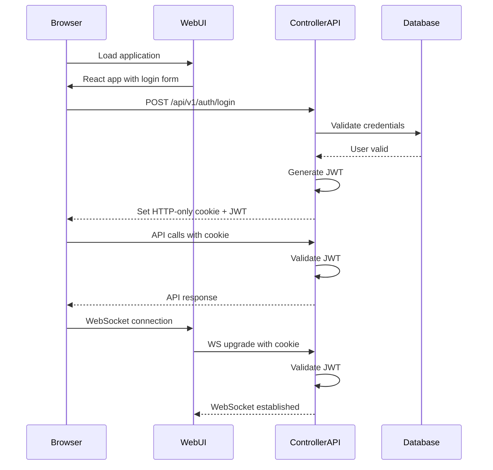

# Pi-Controller System Architecture

## Executive Summary

Pi-Controller is a comprehensive Kubernetes management platform designed specifically for Raspberry Pi clusters. The system provides automated discovery, provisioning, and lifecycle management of K3s clusters while offering GPIO-as-a-Service capabilities through Kubernetes Custom Resources.

## 1. System Overview

### Core Philosophy

- **Single Binary Deployment**: Control plane runs as one Go binary with embedded web UI
- **Zero Dependencies**: No external automation tools (Ansible, Terraform, etc.)
- **Pi-Native**: Optimized for ARM64/ARMv7 hardware constraints
- **Kubernetes-First**: GPIO and hardware control through standard K8s APIs
- **Homelab-Friendly**: Simple deployment with enterprise-grade scalability

### Architecture Principles

- **Distributed Control**: Every Pi can act as control plane node
- **Resilient Communication**: Hybrid gRPC/REST with automatic failover
- **Hardware Abstraction**: GPIO operations via Kubernetes CRDs
- **State Reconciliation**: Continuous drift detection and correction
- **Event-Driven**: Real-time updates via WebSocket streams

## 2. System Components

### 2.1 Control Plane Components

```
┌─────────────────────────────────────────────────────────────────┐
│                    Pi-Controller Control Plane                  │
├─────────────────────────────────────────────────────────────────┤
│  ┌─────────────┐  ┌─────────────┐  ┌─────────────┐  ┌─────────┐ │
│  │ Discovery   │  │ Provisioner │  │ Cluster     │  │ GPIO    │ │
│  │ Service     │  │ Engine      │  │ Manager     │  │ CRD     │ │
│  │             │  │             │  │             │  │ Manager │ │
│  └─────────────┘  └─────────────┘  └─────────────┘  └─────────┘ │
├─────────────────────────────────────────────────────────────────┤
│  ┌─────────────┐  ┌─────────────┐  ┌─────────────┐  ┌─────────┐ │
│  │ Web         │  │ CLI         │  │ MCP         │  │ Event   │ │
│  │ Frontend    │  │ Interface   │  │ Server      │  │ Bus     │ │
│  │             │  │             │  │             │  │         │ │
│  └─────────────┘  └─────────────┘  └─────────────┘  └─────────┘ │
├─────────────────────────────────────────────────────────────────┤
│  ┌─────────────┐  ┌─────────────┐  ┌─────────────┐              │
│  │ State       │  │ Certificate │  │ Backup      │              │
│  │ Database    │  │ Manager     │  │ Manager     │              │
│  │ (SQLite)    │  │             │  │             │              │
│  └─────────────┘  └─────────────┘  └─────────────┘              │
└─────────────────────────────────────────────────────────────────┘
```

### 2.2 Node Components (DaemonSet)

```
┌─────────────────────────────────────────────────────────────────┐
│                    Pi-Controller Node Agent                     │
├─────────────────────────────────────────────────────────────────┤
│  ┌─────────────┐  ┌─────────────┐  ┌─────────────┐  ┌─────────┐ │
│  │ System      │  │ GPIO        │  │ Hardware    │  │ Health  │ │
│  │ Monitor     │  │ Controller  │  │ Monitor     │  │ Check   │ │
│  │             │  │             │  │             │  │ Agent   │ │
│  └─────────────┘  └─────────────┘  └─────────────┘  └─────────┘ │
├─────────────────────────────────────────────────────────────────┤
│  ┌─────────────┐  ┌─────────────┐  ┌─────────────┐              │
│  │ gRPC        │  │ Metrics     │  │ Log         │              │
│  │ Server      │  │ Collector   │  │ Collector   │              │
│  │             │  │             │  │             │              │
│  └─────────────┘  └─────────────┘  └─────────────┘              │
└─────────────────────────────────────────────────────────────────┘
```

## 3. Detailed Component Specifications

### 3.1 Discovery Service

**Purpose**: Automatic Pi node discovery and network mapping
**Technology**: mDNS, network scanning, DHCP lease parsing

**Key Features**:

- Multi-protocol discovery (mDNS, network scan, manual registration)
- Hardware capability detection (GPIO pins, I2C buses, SPI interfaces)
- Network topology mapping with bandwidth testing
- Automatic cluster membership management

**Implementation Details**:

```go
type DiscoveryService struct {
    mdnsClient     *mdns.Client
    networkScanner *NetworkScanner
    nodeRegistry   *NodeRegistry
    capabilities   *CapabilityDetector
}

type DiscoveredNode struct {
    ID           string
    IPAddress    net.IP
    MACAddress   net.HardwareAddr
    Architecture string
    Capabilities NodeCapabilities
    LastSeen     time.Time
    Status       NodeStatus
}
```

### 3.2 Provisioner Engine

**Purpose**: Automated K3s cluster bootstrapping and node joining
**Technology**: SSH, K3s installation scripts, certificate management

**Key Features**:

- Zero-touch K3s installation with custom configurations
- High-availability control plane setup (embedded etcd)
- Automatic node joining with secure token management
- Custom CNI and CSI driver installation
- Pi-optimized K3s configurations (memory limits, storage)

**Implementation Details**:

```go
type ProvisionerEngine struct {
    sshPool        *SSHConnectionPool
    certManager    *CertificateManager
    k3sInstaller   *K3sInstaller
    configRenderer *ConfigTemplateRenderer
}

type ProvisioningPlan struct {
    ClusterID      string
    ControlPlanes  []NodeSpec
    Workers        []NodeSpec
    Configuration  K3sConfig
    NetworkConfig  NetworkConfig
    StorageConfig  StorageConfig
}
```

### 3.3 Cluster Manager

**Purpose**: K8s cluster lifecycle management and state reconciliation
**Technology**: Kubernetes client-go, custom controllers

**Key Features**:

- Multi-cluster state synchronization
- Workload placement optimization based on Pi capabilities
- Resource quota management per cluster
- Automated rolling updates and maintenance
- Cross-cluster networking setup

**Implementation Details**:

```go
type ClusterManager struct {
    k8sClients    map[string]kubernetes.Interface
    stateStore    *StateDatabase
    reconciler    *StateReconciler
    eventBus      *EventBus
}

type ClusterState struct {
    ID            string
    Name          string
    Nodes         []NodeState
    Workloads     []WorkloadState
    Resources     ResourceUsage
    Health        ClusterHealth
    LastReconcile time.Time
}
```

### 3.4 GPIO CRD Manager

**Purpose**: Kubernetes-native GPIO control via Custom Resources
**Technology**: Kubernetes Custom Resource Definitions, controller-runtime

**Key Features**:

- GPIO pin state management through CRDs
- PWM, SPI, I2C interface controls
- Hardware interrupt handling
- GPIO state persistence and recovery
- Multi-tenant GPIO resource isolation

### 3.5 Node Agent (DaemonSet)

**Purpose**: Host-level monitoring and hardware control
**Technology**: gRPC server, system monitoring, GPIO libraries

**Key Features**:

- Real-time system metrics collection
- GPIO pin direct hardware access
- Hardware health monitoring (temperature, voltage)
- Log aggregation and forwarding
- Secure communication with control plane

## 4. API Design

### 4.1 REST API Endpoints

#### Cluster Management

```
GET    /api/v1/clusters                    # List all clusters
POST   /api/v1/clusters                    # Create new cluster
GET    /api/v1/clusters/{id}               # Get cluster details
PUT    /api/v1/clusters/{id}               # Update cluster
DELETE /api/v1/clusters/{id}               # Delete cluster

GET    /api/v1/clusters/{id}/nodes         # List cluster nodes
POST   /api/v1/clusters/{id}/nodes         # Add node to cluster
DELETE /api/v1/clusters/{id}/nodes/{node}  # Remove node from cluster
```

#### Node Management

```
GET    /api/v1/nodes                       # List discovered nodes
GET    /api/v1/nodes/{id}                  # Get node details
PUT    /api/v1/nodes/{id}                  # Update node configuration
POST   /api/v1/nodes/{id}/provision        # Provision node
POST   /api/v1/nodes/{id}/deprovision      # Deprovision node
```

#### GPIO Resources

```
GET    /api/v1/gpio                        # List GPIO resources
POST   /api/v1/gpio                        # Create GPIO resource
GET    /api/v1/gpio/{id}                   # Get GPIO state
PUT    /api/v1/gpio/{id}                   # Update GPIO state
DELETE /api/v1/gpio/{id}                   # Delete GPIO resource
```

### 4.2 gRPC Services

#### Node Agent Communication

```protobuf
service NodeAgent {
    rpc GetSystemMetrics(Empty) returns (SystemMetrics);
    rpc ControlGPIO(GPIORequest) returns (GPIOResponse);
    rpc ExecuteCommand(CommandRequest) returns (CommandResponse);
    rpc StreamLogs(LogFilter) returns (stream LogEntry);
    rpc HealthCheck(Empty) returns (HealthStatus);
}

message SystemMetrics {
    double cpu_usage = 1;
    double memory_usage = 2;
    double temperature = 3;
    double disk_usage = 4;
    repeated NetworkInterface interfaces = 5;
}
```

#### Inter-Service Communication

```protobuf
service ControlPlane {
    rpc RegisterNode(NodeRegistration) returns (RegistrationResponse);
    rpc SyncClusterState(ClusterStateRequest) returns (ClusterStateResponse);
    rpc RequestProvisioning(ProvisioningRequest) returns (ProvisioningResponse);
    rpc ReportHealth(HealthReport) returns (Empty);
}
```

### 4.3 WebSocket Events

#### Real-time Updates

```json
{
    "type": "cluster.node.added",
    "timestamp": "2025-01-15T10:30:00Z",
    "cluster_id": "cluster-1",
    "data": {
        "node_id": "pi-worker-03",
        "ip_address": "192.168.1.103",
        "status": "provisioning"
    }
}

{
    "type": "gpio.state.changed",
    "timestamp": "2025-01-15T10:30:15Z",
    "resource": "led-controller",
    "data": {
        "pin": 18,
        "state": "high",
        "pwm_duty": 75
    }
}
```

## 5. Database Schema Design

### 5.1 SQLite Schema (Control Plane State)

```sql
-- Clusters table
CREATE TABLE clusters (
    id TEXT PRIMARY KEY,
    name TEXT NOT NULL UNIQUE,
    description TEXT,
    k3s_version TEXT NOT NULL,
    config JSON NOT NULL,
    status TEXT NOT NULL,
    created_at TIMESTAMP DEFAULT CURRENT_TIMESTAMP,
    updated_at TIMESTAMP DEFAULT CURRENT_TIMESTAMP
);

-- Nodes table
CREATE TABLE nodes (
    id TEXT PRIMARY KEY,
    cluster_id TEXT REFERENCES clusters(id),
    hostname TEXT NOT NULL,
    ip_address TEXT NOT NULL,
    mac_address TEXT NOT NULL,
    architecture TEXT NOT NULL,
    role TEXT NOT NULL, -- control-plane, worker
    status TEXT NOT NULL, -- discovered, provisioning, ready, error
    capabilities JSON NOT NULL,
    last_seen TIMESTAMP DEFAULT CURRENT_TIMESTAMP,
    created_at TIMESTAMP DEFAULT CURRENT_TIMESTAMP,
    updated_at TIMESTAMP DEFAULT CURRENT_TIMESTAMP
);

-- GPIO Resources table
CREATE TABLE gpio_resources (
    id TEXT PRIMARY KEY,
    node_id TEXT NOT NULL REFERENCES nodes(id),
    name TEXT NOT NULL,
    namespace TEXT NOT NULL,
    pin_number INTEGER NOT NULL,
    pin_type TEXT NOT NULL, -- digital, pwm, spi, i2c
    state JSON NOT NULL,
    created_at TIMESTAMP DEFAULT CURRENT_TIMESTAMP,
    updated_at TIMESTAMP DEFAULT CURRENT_TIMESTAMP,
    UNIQUE(node_id, pin_number)
);

-- Events table
CREATE TABLE events (
    id INTEGER PRIMARY KEY AUTOINCREMENT,
    type TEXT NOT NULL,
    resource_type TEXT NOT NULL,
    resource_id TEXT NOT NULL,
    data JSON NOT NULL,
    timestamp TIMESTAMP DEFAULT CURRENT_TIMESTAMP
);

-- Configuration table
CREATE TABLE configuration (
    key TEXT PRIMARY KEY,
    value TEXT NOT NULL,
    updated_at TIMESTAMP DEFAULT CURRENT_TIMESTAMP
);

-- Create indexes for performance
CREATE INDEX idx_nodes_cluster ON nodes(cluster_id);
CREATE INDEX idx_nodes_status ON nodes(status);
CREATE INDEX idx_gpio_node ON gpio_resources(node_id);
CREATE INDEX idx_events_type ON events(type);
CREATE INDEX idx_events_timestamp ON events(timestamp);
```

## 6. GPIO Custom Resource Definitions

### 6.1 GPIO Pin CRD

```yaml
apiVersion: apiextensions.k8s.io/v1
kind: CustomResourceDefinition
metadata:
  name: gpiopins.hardware.pi-controller.io
spec:
  group: hardware.pi-controller.io
  versions:
  - name: v1
    served: true
    storage: true
    schema:
      openAPIV3Schema:
        type: object
        properties:
          spec:
            type: object
            properties:
              nodeSelector:
                type: object
                additionalProperties:
                  type: string
              pin:
                type: integer
                minimum: 1
                maximum: 40
              mode:
                type: string
                enum: ["input", "output", "pwm"]
              initialState:
                type: string
                enum: ["low", "high"]
              pullResistor:
                type: string
                enum: ["none", "up", "down"]
          status:
            type: object
            properties:
              state:
                type: string
              assignedNode:
                type: string
              lastUpdated:
                type: string
                format: date-time
  scope: Namespaced
  names:
    plural: gpiopins
    singular: gpiopin
    kind: GPIOPin
```

### 6.2 PWM Controller CRD

```yaml
apiVersion: apiextensions.k8s.io/v1
kind: CustomResourceDefinition
metadata:
  name: pwmcontrollers.hardware.pi-controller.io
spec:
  group: hardware.pi-controller.io
  versions:
  - name: v1
    served: true
    storage: true
    schema:
      openAPIV3Schema:
        type: object
        properties:
          spec:
            type: object
            properties:
              nodeSelector:
                type: object
              pin:
                type: integer
              frequency:
                type: integer
                minimum: 1
                maximum: 100000
              dutyCycle:
                type: integer
                minimum: 0
                maximum: 100
          status:
            type: object
            properties:
              active:
                type: boolean
              currentDutyCycle:
                type: integer
              assignedNode:
                type: string
  scope: Namespaced
  names:
    plural: pwmcontrollers
    singular: pwmcontroller
    kind: PWMController
```

### 6.3 I2C Device CRD

```yaml
apiVersion: apiextensions.k8s.io/v1
kind: CustomResourceDefinition
metadata:
  name: i2cdevices.hardware.pi-controller.io
spec:
  group: hardware.pi-controller.io
  versions:
  - name: v1
    served: true
    storage: true
    schema:
      openAPIV3Schema:
        type: object
        properties:
          spec:
            type: object
            properties:
              nodeSelector:
                type: object
              bus:
                type: integer
                minimum: 0
                maximum: 1
              address:
                type: string
                pattern: "^0x[0-9A-Fa-f]{2}$"
              deviceType:
                type: string
          status:
            type: object
            properties:
              connected:
                type: boolean
              lastResponse:
                type: string
              assignedNode:
                type: string
  scope: Namespaced
  names:
    plural: i2cdevices
    singular: i2cdevice
    kind: I2CDevice
```

## 7. Deployment Architecture

### 7.1 Distribution Strategy

```
┌─────────────────┐    ┌─────────────────┐    ┌─────────────────┐
│   Pi Master 1   │    │   Pi Master 2   │    │   Pi Master 3   │
│                 │    │                 │    │                 │
│ ┌─────────────┐ │    │ ┌─────────────┐ │    │ ┌─────────────┐ │
│ │Control Plane│ │    │ │Control Plane│ │    │ │Control Plane│ │
│ │   (Active)  │ │    │ │ (Standby)   │ │    │ │ (Standby)   │ │
│ └─────────────┘ │    │ └─────────────┘ │    │ └─────────────┘ │
│ ┌─────────────┐ │    │ ┌─────────────┐ │    │ ┌─────────────┐ │
│ │ Node Agent  │ │    │ │ Node Agent  │ │    │ │ Node Agent  │ │
│ │(DaemonSet)  │ │    │ │(DaemonSet)  │ │    │ │(DaemonSet)  │ │
│ └─────────────┘ │    │ └─────────────┘ │    │ └─────────────┘ │
│ ┌─────────────┐ │    │ ┌─────────────┐ │    │ ┌─────────────┐ │
│ │     K3s     │ │    │ │     K3s     │ │    │ │     K3s     │ │
│ │ Server Node │ │    │ │ Server Node │ │    │ │ Server Node │ │
│ └─────────────┘ │    │ └─────────────┘ │    │ └─────────────┘ │
└─────────────────┘    └─────────────────┘    └─────────────────┘
         │                       │                       │
         └───────────┬───────────┴───────────┬───────────┘
                     │                       │
┌─────────────────┐  │  ┌─────────────────┐  │  ┌─────────────────┐
│  Pi Worker 1    │  │  │  Pi Worker 2    │  │  │  Pi Worker N    │
│                 │  │  │                 │  │  │                 │
│ ┌─────────────┐ │  │  │ ┌─────────────┐ │  │  │ ┌─────────────┐ │
│ │ Node Agent  │ │  │  │ │ Node Agent  │ │  │  │ │ Node Agent  │ │
│ │(DaemonSet)  │ │  │  │ │(DaemonSet)  │ │  │  │ │(DaemonSet)  │ │
│ └─────────────┘ │  │  │ └─────────────┘ │  │  │ └─────────────┘ │
│ ┌─────────────┐ │  │  │ ┌─────────────┐ │  │  │ ┌─────────────┐ │
│ │     K3s     │ │  │  │ │     K3s     │ │  │  │ │     K3s     │ │
│ │ Agent Node  │ │  │  │ │ Agent Node  │ │  │  │ │ Agent Node  │ │
│ └─────────────┘ │  │  │ └─────────────┘ │  │  │ └─────────────┘ │
└─────────────────┘  │  └─────────────────┘  │  └─────────────────┘
                     │                       │
              Load Balancer / VIP
                 (keepalived)
```

### 7.2 Component Distribution

**Control Plane Nodes (Masters)**:

- Pi-Controller binary (single process)
- Embedded SQLite database (with replication)
- Web UI (embedded static files)
- MCP server
- Node Agent DaemonSet pod
- K3s server with embedded etcd

**Worker Nodes**:

- Node Agent DaemonSet pod only
- K3s agent process
- Local storage for workloads

### 7.3 Installation Methods

#### Single Command Installation

```bash
# Bootstrap first control plane node
curl -sfL https://get.pi-controller.io/install.sh | sh -s - \
  --cluster-init \
  --node-role=server \
  --web-ui-port=8080

# Join additional nodes
curl -sfL https://get.pi-controller.io/install.sh | sh -s - \
  --server https://pi-master-1:8080 \
  --token=<join-token> \
  --node-role=worker
```

#### Docker Compose (Development)

```yaml
version: '3.8'
services:
  pi-controller:
    image: pi-controller:latest
    ports:
      - "8080:8080"
      - "6443:6443"
    volumes:
      - ./data:/data
      - /var/run/docker.sock:/var/run/docker.sock
    privileged: true
    environment:
      - CLUSTER_INIT=true
      - DATA_DIR=/data
```

## 8. Security Model

### 8.1 Authentication & Authorization

#### Multi-Tier Security Architecture

```
┌─────────────────────────────────────────────────────────────────┐
│                      External Clients                          │
├─────────────────────────────────────────────────────────────────┤
│ Web UI │ CLI │ MCP Server │ External APIs                       │
└───┬─────────┬──────────┬─────────────────────────────────────┘
    │         │          │
    │ HTTPS   │ mTLS     │ JWT/OIDC
    │         │          │
┌───▼─────────▼──────────▼─────────────────────────────────────────┐
│                  Pi-Controller Gateway                          │
├─────────────────────────────────────────────────────────────────┤
│ • Certificate-based authentication                              │
│ • RBAC policy enforcement                                       │
│ • Rate limiting and DDoS protection                            │
│ • Audit logging                                                │
└─────────────────────┬───────────────────────────────────────────┘
                      │ mTLS
┌─────────────────────▼───────────────────────────────────────────┐
│                Internal Services                               │
├─────────────────────────────────────────────────────────────────┤
│ Discovery │ Provisioner │ Cluster Manager │ GPIO CRD Manager   │
└─────────────────────┬───────────────────────────────────────────┘
                      │ gRPC with mTLS
┌─────────────────────▼───────────────────────────────────────────┐
│                   Node Agents                                  │
├─────────────────────────────────────────────────────────────────┤
│ • Certificate-based node identity                              │
│ • Hardware security module integration                         │
│ • Secure GPIO access controls                                  │
└─────────────────────────────────────────────────────────────────┘
```

#### RBAC Policies

```yaml
# Cluster Administrator Role
apiVersion: rbac.authorization.k8s.io/v1
kind: ClusterRole
metadata:
  name: pi-controller:cluster-admin
rules:
- apiGroups: ["*"]
  resources: ["*"]
  verbs: ["*"]
- apiGroups: ["hardware.pi-controller.io"]
  resources: ["*"]
  verbs: ["*"]

# GPIO Operator Role
apiVersion: rbac.authorization.k8s.io/v1
kind: ClusterRole
metadata:
  name: pi-controller:gpio-operator
rules:
- apiGroups: ["hardware.pi-controller.io"]
  resources: ["gpiopins", "pwmcontrollers", "i2cdevices"]
  verbs: ["get", "list", "create", "update", "patch", "delete"]

# Read-Only Monitoring Role
apiVersion: rbac.authorization.k8s.io/v1
kind: ClusterRole
metadata:
  name: pi-controller:monitor
rules:
- apiGroups: [""]
  resources: ["nodes", "pods", "services"]
  verbs: ["get", "list", "watch"]
- apiGroups: ["hardware.pi-controller.io"]
  resources: ["*"]
  verbs: ["get", "list", "watch"]
```

### 8.2 Communication Security

#### Certificate Management

- **Root CA**: Self-signed cluster root certificate authority
- **Node Certificates**: Unique client certificates for each Pi node
- **Service Certificates**: TLS certificates for all internal services
- **Automatic Rotation**: 30-day certificate lifecycle with auto-renewal
- **Hardware Security**: TPM/secure enclave integration where available

#### Network Security

```go
type SecurityConfig struct {
    TLS struct {
        CACertPath     string
        CertPath       string
        KeyPath        string
        MinVersion     uint16 // TLS 1.3
        CipherSuites   []uint16
    }

    Authentication struct {
        Method         string // "certificate", "jwt", "oidc"
        JWTSecret      string
        OIDCIssuer     string
        TokenExpiry    time.Duration
    }

    Authorization struct {
        EnableRBAC     bool
        PolicyFile     string
        AuditLog       string
    }

    Network struct {
        AllowedCIDRs   []string
        RateLimits     map[string]int
        FirewallRules  []FirewallRule
    }
}
```

### 8.3 GPIO Security Model

#### Hardware Access Control

- **Pin Reservation**: Exclusive GPIO pin access via Kubernetes leases
- **Privilege Escalation**: Controlled sudo access for hardware operations
- **Hardware Abstraction**: No direct /dev/mem access from containers
- **Safety Limits**: Voltage/current monitoring with automatic shutdown

#### Resource Isolation

```yaml
apiVersion: v1
kind: Namespace
metadata:
  name: gpio-tenant-1
  labels:
    pi-controller.io/gpio-policy: "restricted"
---
apiVersion: hardware.pi-controller.io/v1
kind: GPIOQuota
metadata:
  name: tenant-1-quota
  namespace: gpio-tenant-1
spec:
  hard:
    gpiopins: "10"
    pwmcontrollers: "2"
    i2cdevices: "5"
    power-budget: "500mW"
```

## 9. Development Project Structure

### 9.1 Repository Layout

```
pi-controller/
├── cmd/                           # Application entry points
│   ├── pi-controller/            # Main control plane binary
│   ├── pi-agent/                 # Node agent binary
│   └── pi-cli/                   # CLI tool
├── pkg/                          # Reusable packages
│   ├── api/                      # API definitions and handlers
│   │   ├── rest/                 # REST API handlers
│   │   ├── grpc/                 # gRPC service implementations
│   │   └── websocket/            # WebSocket handlers
│   ├── discovery/                # Node discovery service
│   ├── provisioner/              # Cluster provisioning engine
│   ├── cluster/                  # Cluster management
│   ├── gpio/                     # GPIO CRD controllers
│   ├── agent/                    # Node agent components
│   ├── database/                 # Database abstraction layer
│   ├── security/                 # Authentication/authorization
│   ├── config/                   # Configuration management
│   └── util/                     # Shared utilities
├── internal/                     # Private packages
│   ├── server/                   # HTTP/gRPC server setup
│   ├── storage/                  # SQLite database layer
│   ├── certificates/             # Certificate management
│   └── hardware/                 # Hardware abstraction
├── web/                          # Frontend application
│   ├── src/                      # React TypeScript source
│   ├── public/                   # Static assets
│   └── dist/                     # Built assets (embedded)
├── deploy/                       # Deployment manifests
│   ├── k8s/                      # Kubernetes manifests
│   ├── docker/                   # Docker configurations
│   └── scripts/                  # Installation scripts
├── docs/                         # Documentation
├── test/                         # Test files
│   ├── integration/              # Integration tests
│   ├── e2e/                      # End-to-end tests
│   └── fixtures/                 # Test data
├── proto/                        # Protocol buffer definitions
├── config/                       # Configuration examples
└── tools/                        # Development tools
```

### 9.2 Module Breakdown

#### Core Modules

**cmd/pi-controller (Main Binary)**

```go
package main

import (
    "github.com/pi-controller/pkg/server"
    "github.com/pi-controller/pkg/config"
    "github.com/pi-controller/internal/storage"
)

func main() {
    cfg := config.Load()
    db := storage.NewSQLite(cfg.DatabasePath)
    srv := server.New(cfg, db)
    srv.Start()
}
```

**pkg/discovery (Node Discovery)**

```go
package discovery

type Service interface {
    Start(ctx context.Context) error
    Stop() error
    DiscoveredNodes() <-chan Node
    RegisterNode(node Node) error
    UnregisterNode(nodeID string) error
}

type Node struct {
    ID           string
    Hostname     string
    IPAddress    net.IP
    MACAddress   net.HardwareAddr
    Architecture string
    Capabilities NodeCapabilities
    LastSeen     time.Time
}
```

**pkg/provisioner (Cluster Provisioning)**

```go
package provisioner

type Engine interface {
    CreateCluster(ctx context.Context, plan ClusterPlan) error
    AddNode(ctx context.Context, clusterID string, node NodeSpec) error
    RemoveNode(ctx context.Context, clusterID, nodeID string) error
    GetClusterStatus(clusterID string) (ClusterStatus, error)
}

type ClusterPlan struct {
    ID            string
    Name          string
    K3sVersion    string
    ControlPlanes []NodeSpec
    Workers       []NodeSpec
    Config        K3sConfig
}
```

**pkg/gpio (GPIO Controllers)**

```go
package gpio

type Controller interface {
    Reconcile(ctx context.Context, req reconcile.Request) (reconcile.Result, error)
}

type PinController struct {
    client.Client
    scheme *runtime.Scheme
    agent  AgentClient
}
```

### 9.3 Build System

#### Multi-Architecture Builds

```makefile
# Makefile
GOARCH ?= arm64
GOOS ?= linux
VERSION ?= $(shell git describe --tags --dirty)

.PHONY: build-all
build-all: build-controller build-agent build-cli

.PHONY: build-controller
build-controller:
 CGO_ENABLED=1 GOOS=$(GOOS) GOARCH=$(GOARCH) go build \
  -ldflags "-X main.version=$(VERSION)" \
  -o bin/pi-controller-$(GOOS)-$(GOARCH) \
  ./cmd/pi-controller

.PHONY: build-agent
build-agent:
 CGO_ENABLED=1 GOOS=$(GOOS) GOARCH=$(GOARCH) go build \
  -ldflags "-X main.version=$(VERSION)" \
  -o bin/pi-agent-$(GOOS)-$(GOARCH) \
  ./cmd/pi-agent

.PHONY: docker-build
docker-build:
 docker buildx build --platform linux/arm64,linux/amd64 \
  -t pi-controller:$(VERSION) \
  --push .
```

#### Docker Multi-Stage Build

```dockerfile
# Dockerfile
FROM --platform=$BUILDPLATFORM node:18-alpine AS web-builder
WORKDIR /app/web
COPY web/package*.json ./
RUN npm ci
COPY web/ ./
RUN npm run build

FROM --platform=$BUILDPLATFORM golang:1.21-alpine AS go-builder
RUN apk add --no-cache git gcc musl-dev sqlite-dev
WORKDIR /app
COPY go.mod go.sum ./
RUN go mod download
COPY . .
COPY --from=web-builder /app/web/dist ./web/dist
ARG TARGETOS TARGETARCH
RUN CGO_ENABLED=1 GOOS=$TARGETOS GOARCH=$TARGETARCH \
    go build -o pi-controller ./cmd/pi-controller

FROM alpine:3.18
RUN apk add --no-cache ca-certificates sqlite
COPY --from=go-builder /app/pi-controller /usr/local/bin/
EXPOSE 8080 6443
ENTRYPOINT ["/usr/local/bin/pi-controller"]
```

## 10. Performance and Scalability Considerations

### 10.1 Pi Hardware Optimization

#### Resource-Aware Scheduling

```go
type NodeCapacity struct {
    CPU       resource.Quantity  // ARM cores available
    Memory    resource.Quantity  // RAM capacity
    Storage   resource.Quantity  // SD card/USB storage
    GPIOPins  int               // Available GPIO pins
    I2CBuses  int               // Available I2C buses
    SPIBuses  int               // Available SPI buses
    PowerBudget resource.Quantity // Available power (mW)
}

type ResourceOptimizer struct {
    nodeCapacities map[string]NodeCapacity
    workloadProfiles map[string]WorkloadProfile
    scheduler *Scheduler
}
```

#### Memory Management

- **SQLite WAL Mode**: Optimized for concurrent reads
- **Connection Pooling**: Limited database connections per Pi
- **Memory Caching**: LRU cache for frequently accessed data
- **Garbage Collection Tuning**: Lower GC pressure for ARM processors

### 10.2 Network Optimization

#### Efficient Communication Patterns

- **gRPC Streaming**: Reduce connection overhead for real-time data
- **Message Batching**: Group GPIO operations to reduce network calls
- **Compression**: gRPC compression for large data transfers
- **Connection Multiplexing**: HTTP/2 for web UI and API calls

#### Network Resilience

```go
type NetworkManager struct {
    connectionPool *grpc.ClientPool
    retryPolicy   *ExponentialBackoff
    circuitBreaker *CircuitBreaker
    healthChecker *HealthChecker
}

type ConnectionPolicy struct {
    MaxRetries        int
    BackoffMultiplier float64
    MaxBackoff        time.Duration
    HealthCheckInterval time.Duration
    CircuitBreakerThreshold int
}
```

### 10.3 Scalability Architecture

#### Horizontal Scaling (1-100+ Nodes)

- **Distributed Control Plane**: Multiple control plane nodes with leader election
- **Sharded Database**: SQLite WAL with backup replication
- **Load Balancing**: HAProxy/keepalived for API endpoint distribution
- **Event Batching**: Aggregate events before processing

#### Vertical Scaling (Per-Node Optimization)

- **Resource Quotas**: Prevent resource exhaustion
- **Priority Classes**: Critical system workloads get priority
- **Node Affinity**: Pin system workloads to appropriate hardware
- **Local Storage**: Prefer local storage for performance-critical workloads

## Conclusion

This architecture provides a robust, scalable foundation for managing Raspberry Pi Kubernetes clusters with GPIO-as-a-Service capabilities. The design balances simplicity of deployment with enterprise-grade features, making it suitable for both homelab enthusiasts and small-scale IoT deployments.

Key architectural strengths:

- **Single binary deployment** reduces complexity
- **Kubernetes-native GPIO control** provides familiar APIs
- **Multi-protocol communication** ensures reliability
- **Hardware-aware scheduling** optimizes Pi resource usage
- **Comprehensive security model** protects infrastructure and hardware

The modular design allows for incremental development and testing, while the detailed specifications enable multiple development teams to work in parallel on different components.

## 11. Controller & Web Interface Architecture Details

### 11.1 Single Binary Architecture

The pi-controller binary is designed as a monolithic application that embeds all necessary components:

```go
type ControllerServer struct {
    // Core services
    discoveryService  *discovery.Service
    provisionerEngine *provisioner.Engine
    clusterManager    *cluster.Manager
    gpioManager       *gpio.Manager

    // Communication layers
    httpServer        *http.Server
    grpcServer        *grpc.Server
    websocketHub      *websocket.Hub
    mcpServer         *mcp.Server

    // Data layer
    database          *storage.Database
    configManager     *config.Manager

    // Frontend assets (optional)
    webUIHandler      *WebUIHandler
    webUIEnabled      bool
}
```

#### Binary Structure & Deployment Modes

```
pi-controller (single binary ~35MB)
├── Core Application Logic (Go)
├── SQLite Database Engine
├── gRPC Protocol Buffers
├── TLS Certificates (self-signed defaults)
├── Configuration Templates
└── Optional Embedded Minimal Web UI (~5MB)
    ├── Basic cluster overview
    ├── Node status display
    └── Emergency management interface

Deployment Modes:
├── 1. Standalone Mode (on Pi nodes)
│   ├── Full control plane functionality
│   ├── Local database storage
│   └── Direct hardware access
├── 2. Container Mode (Docker/K8s)
│   ├── Stateless control plane
│   ├── External database connection
│   └── Network-based hardware control
└── 3. Remote Control Host Mode
    ├── Management workstation deployment
    ├── Remote cluster provisioning
    └── Central multi-cluster management
```

### 11.2 Web Interface Architecture

The web interface is maintained as a separate repository (`kubes-aura`) and can be deployed in multiple ways:

#### Deployment Options

1. **CRD-Based Kubernetes Deployment (Recommended)**
   - Deployed as a Custom Resource after cluster formation
   - Automatically pulled and deployed when cluster is ready
   - Scales with cluster and provides full functionality

2. **Embedded Minimal UI (Fallback)**
   - Lightweight interface embedded in binary
   - Basic cluster status and emergency operations
   - Used when full UI is unavailable

3. **External Deployment**
   - Standalone deployment on separate infrastructure
   - Can manage multiple clusters remotely
   - Corporate/enterprise deployment pattern

#### CRD-Based Web UI Deployment

```yaml
apiVersion: ui.pi-controller.io/v1
kind: WebInterface
metadata:
  name: kubes-aura-ui
  namespace: pi-controller-system
spec:
  version: "latest"
  repository: "ghcr.io/dsyorkd/kubes-aura"
  replicas: 2
  resources:
    limits:
      cpu: "500m"
      memory: "512Mi"
    requests:  
      cpu: "100m"
      memory: "128Mi"
  ingress:
    enabled: true
    hostname: "pi-controller.local"
    tls: true
  features:
    - clusterManagement
    - gpioControl
    - monitoring
    - nodeProvisioning
```

#### Frontend Technology Stack (Separate Repository)

```typescript
// kubes-aura Repository Architecture
interface WebUIArchitecture {
  framework: "React 18 + TypeScript";
  stateManagement: "Zustand + React Query";
  routing: "React Router v6";
  uiComponents: "Tailwind CSS + Headless UI";
  realTimeUpdates: "WebSocket + EventSource";
  authentication: "JWT + HTTP-only cookies";
  buildTool: "Vite";
  bundleSize: "~8MB (full featured)";
  containerImage: "~50MB Alpine-based";
  repository: "https://github.com/dsyorkd/kubes-aura";
}
```

#### Frontend-Backend Communication Patterns

```typescript
// API Client Architecture
class ApiClient {
  private baseURL: string;
  private authToken: string;
  private wsConnection: WebSocket;

  // REST API calls
  async getClusters(): Promise<Cluster[]> {
    return this.get('/api/v1/clusters');
  }

  // Real-time updates via WebSocket
  subscribeToClusterEvents(clusterId: string, callback: EventCallback) {
    this.wsConnection.send({
      type: 'subscribe',
      channel: `cluster.${clusterId}.events`
    });
  }

  // Server-Sent Events for long-running operations
  streamProvisioningStatus(nodeId: string): EventSource {
    return new EventSource(`/api/v1/nodes/${nodeId}/provision/stream`);
  }
}
```

#### Web UI Component Structure (kubes-aura Repository)

```
kubes-aura/
├── src/
│   ├── components/           # Reusable UI components
│   │   ├── common/          # Generic components (Button, Modal, etc.)
│   │   ├── cluster/         # Cluster-specific components
│   │   ├── gpio/            # GPIO control components
│   │   └── monitoring/      # System monitoring components
│   ├── pages/               # Route-level components
│   │   ├── Dashboard.tsx    # Main overview page
│   │   ├── Clusters.tsx     # Cluster management
│   │   ├── Nodes.tsx        # Node management
│   │   ├── GPIO.tsx         # GPIO resources
│   │   └── Settings.tsx     # System configuration
│   ├── hooks/               # Custom React hooks
│   │   ├── useWebSocket.ts  # WebSocket connection hook
│   │   ├── useAuth.ts       # Authentication hook
│   │   └── useGPIO.ts       # GPIO state management hook
│   ├── services/            # API service layer
│   │   ├── api.ts           # REST API client
│   │   ├── websocket.ts     # WebSocket client
│   │   └── auth.ts          # Authentication service
│   ├── store/               # Global state management
│   │   ├── authStore.ts     # User authentication state
│   │   ├── clusterStore.ts  # Cluster state
│   │   └── gpioStore.ts     # GPIO resource state
│   └── types/               # TypeScript type definitions
│       ├── api.ts           # API response types
│       ├── cluster.ts       # Cluster-related types
│       └── gpio.ts          # GPIO resource types
├── Dockerfile               # Container build configuration
├── k8s/                     # Kubernetes deployment manifests
│   ├── deployment.yaml      # Web UI deployment
│   ├── service.yaml         # Service configuration
│   └── ingress.yaml         # Ingress configuration
└── README.md                # Project documentation
```

### 11.3 HTTP Server & Route Architecture

#### Server Initialization & Route Setup

```go
func (s *ControllerServer) setupHTTPServer() *http.Server {
    router := mux.NewRouter()

    // API routes with versioning
    apiV1 := router.PathPrefix("/api/v1").Subrouter()
    apiV1.Use(s.authMiddleware, s.corsMiddleware, s.loggingMiddleware)

    // Cluster management endpoints
    apiV1.HandleFunc("/clusters", s.handleClusters).Methods("GET", "POST")
    apiV1.HandleFunc("/clusters/{id}", s.handleCluster).Methods("GET", "PUT", "DELETE")
    apiV1.HandleFunc("/clusters/{id}/nodes", s.handleClusterNodes).Methods("GET", "POST")

    // Node management endpoints
    apiV1.HandleFunc("/nodes", s.handleNodes).Methods("GET")
    apiV1.HandleFunc("/nodes/{id}", s.handleNode).Methods("GET", "PUT")
    apiV1.HandleFunc("/nodes/{id}/provision", s.handleNodeProvision).Methods("POST")
    apiV1.HandleFunc("/nodes/{id}/provision/stream", s.handleProvisionStream).Methods("GET")

    // GPIO endpoints
    apiV1.HandleFunc("/gpio", s.handleGPIOResources).Methods("GET", "POST")
    apiV1.HandleFunc("/gpio/{id}", s.handleGPIOResource).Methods("GET", "PUT", "DELETE")

    // WebSocket endpoint for real-time updates
    router.HandleFunc("/ws", s.handleWebSocket)

    // Health check endpoint (unauthenticated)
    router.HandleFunc("/health", s.handleHealth).Methods("GET")

    // Static file serving (embedded web UI)
    router.PathPrefix("/").Handler(s.webUIHandler())

    return &http.Server{
        Addr:         fmt.Sprintf(":%d", s.config.HTTPPort),
        Handler:      router,
        TLSConfig:    s.tlsConfig,
        ReadTimeout:  30 * time.Second,
        WriteTimeout: 30 * time.Second,
        IdleTimeout:  120 * time.Second,
    }
}
```

#### Static Asset Serving

```go
//go:embed web/dist/*
var webUIAssets embed.FS

func (s *ControllerServer) webUIHandler() http.Handler {
    // Serve embedded React app
    webUI, _ := fs.Sub(webUIAssets, "web/dist")
    fileServer := http.FileServer(http.FS(webUI))

    return http.HandlerFunc(func(w http.ResponseWriter, r *http.Request) {
        // Handle client-side routing (SPA)
        if !strings.Contains(r.URL.Path, ".") && r.URL.Path != "/" {
            r.URL.Path = "/"
        }

        // Security headers
        w.Header().Set("X-Content-Type-Options", "nosniff")
        w.Header().Set("X-Frame-Options", "DENY")
        w.Header().Set("X-XSS-Protection", "1; mode=block")

        fileServer.ServeHTTP(w, r)
    })
}
```

### 11.4 Authentication & Session Management

#### JWT-based Authentication Flow



#### Authentication Implementation

```go
type AuthManager struct {
    jwtSecret     []byte
    tokenExpiry   time.Duration
    refreshExpiry time.Duration
    userStore     UserStore
}

func (am *AuthManager) GenerateTokens(userID string) (TokenPair, error) {
    accessClaims := jwt.MapClaims{
        "sub": userID,
        "exp": time.Now().Add(am.tokenExpiry).Unix(),
        "iat": time.Now().Unix(),
        "type": "access",
    }

    refreshClaims := jwt.MapClaims{
        "sub": userID,
        "exp": time.Now().Add(am.refreshExpiry).Unix(),
        "iat": time.Now().Unix(),
        "type": "refresh",
    }

    accessToken := jwt.NewWithClaims(jwt.SigningMethodHS256, accessClaims)
    refreshToken := jwt.NewWithClaims(jwt.SigningMethodHS256, refreshClaims)

    accessString, _ := accessToken.SignedString(am.jwtSecret)
    refreshString, _ := refreshToken.SignedString(am.jwtSecret)

    return TokenPair{
        AccessToken:  accessString,
        RefreshToken: refreshString,
    }, nil
}
```

## 12. Deployment Architecture & Binary Usage

### 12.1 Deployment Mode Overview

The pi-controller binary supports three distinct deployment modes, each optimized for different use cases:

#### Mode 1: Standalone Pi Deployment

```
┌─────────────────────────────────────────────────────────┐
│                    Raspberry Pi Node                   │
├─────────────────────────────────────────────────────────┤
│  ┌─────────────────────────────────────────────────────┐│
│  │              pi-controller binary                   ││
│  │ ┌─────────────┐ ┌─────────────┐ ┌─────────────────┐ ││
│  │ │ Control     │ │ SQLite      │ │ Embedded        │ ││
│  │ │ Plane       │ │ Database    │ │ Minimal UI      │ ││
│  │ │ Services    │ │             │ │                 │ ││
│  │ └─────────────┘ └─────────────┘ └─────────────────┘ ││
│  └─────────────────────────────────────────────────────┘│
├─────────────────────────────────────────────────────────┤
│  ┌─────────────────────────────────────────────────────┐│
│  │                 K3s Cluster                         ││
│  │ ┌─────────────┐ ┌─────────────┐ ┌─────────────────┐ ││
│  │ │ Full Web UI │ │ GPIO        │ │ Node Agent      │ ││
│  │ │ (CRD)       │ │ Controllers │ │ DaemonSet       │ ││
│  │ └─────────────┘ └─────────────┘ └─────────────────┘ ││
│  └─────────────────────────────────────────────────────┘│
└─────────────────────────────────────────────────────────┘
```

#### Mode 2: Container Deployment

```
┌─────────────────────────────────────────────────────────┐
│              Docker/Kubernetes Host                     │
├─────────────────────────────────────────────────────────┤
│  ┌─────────────────────────────────────────────────────┐│
│  │         pi-controller container                     ││
│  │ ┌─────────────┐ ┌─────────────┐ ┌─────────────────┐ ││
│  │ │ Control     │ │ External DB │ │ Config          │ ││
│  │ │ Plane       │ │ Connection  │ │ Volume          │ ││
│  │ │ Services    │ │             │ │ Mount           │ ││
│  │ └─────────────┘ └─────────────┘ └─────────────────┘ ││
│  └─────────────────────────────────────────────────────┘│
├─────────────────────────────────────────────────────────┤
│  External PostgreSQL Database                          │
│  Network Access to Target Pi Clusters                  │
└─────────────────────────────────────────────────────────┘
```

#### Mode 3: Remote Control Host

```
┌─────────────────────────────────────────────────────────┐
│                Management Workstation                  │
├─────────────────────────────────────────────────────────┤
│  ┌─────────────────────────────────────────────────────┐│
│  │              pi-controller binary                   ││
│  │ ┌─────────────┐ ┌─────────────┐ ┌─────────────────┐ ││
│  │ │ Multi-      │ │ Local       │ │ Full Web UI     │ ││
│  │ │ Cluster     │ │ Database    │ │ (Embedded)      │ ││
│  │ │ Manager     │ │             │ │                 │ ││
│  │ └─────────────┘ └─────────────┘ └─────────────────┘ ││
│  └─────────────────────────────────────────────────────┘│
├─────────────────────────────────────────────────────────┤
│             Network Connections to:                     │
│  ┌─────────────┐ ┌─────────────┐ ┌─────────────────────┐│
│  │ Pi Cluster  │ │ Pi Cluster  │ │ Pi Cluster          ││
│  │ Site A      │ │ Site B      │ │ Site C              ││
│  │             │ │             │ │                     ││
│  └─────────────┘ └─────────────┘ └─────────────────────┘│
└─────────────────────────────────────────────────────────┘
```

### 12.2 Binary Usage Patterns

#### Command-Line Interface Design

```bash
# Primary binary: pi-controller
pi-controller [GLOBAL-OPTIONS] COMMAND [COMMAND-OPTIONS]

# Global options apply to all commands
Global Options:
  --config PATH        Configuration file path (default: /etc/pi-controller/config.yaml)
  --data-dir PATH      Data directory path (default: /var/lib/pi-controller)
  --log-level LEVEL    Logging level: debug, info, warn, error (default: info)
  --log-format FORMAT  Log format: json, text (default: text)

# Primary Commands:
pi-controller server                    # Run control plane server (default)
pi-controller agent                     # Run node agent only
pi-controller cluster                   # Cluster management commands
pi-controller node                      # Node management commands
pi-controller gpio                      # GPIO resource commands
pi-controller config                    # Configuration management
pi-controller cert                      # Certificate management
pi-controller backup                    # Backup/restore operations
pi-controller version                   # Version information
```

#### Server Command (Primary Usage)

```bash
# Server command - runs the full control plane
pi-controller server [OPTIONS]

Server Options:
  --bind-address IP        HTTP server bind address (default: 0.0.0.0)
  --http-port PORT         HTTP/HTTPS port (default: 8080)
  --grpc-port PORT         gRPC port (default: 9090)
  --cluster-init           Initialize new cluster (first node only)
  --join-token TOKEN       Join existing cluster with token
  --server-url URL         Existing cluster server URL for joining
  --node-role ROLE         Node role: server, agent (default: server)
  --deployment-mode MODE   Deployment mode: standalone, container, remote (default: standalone)
  --web-ui-enabled         Enable embedded web UI (default: true)
  --web-ui-mode MODE       Web UI mode: embedded, external, crd (default: crd)
  --web-ui-path PATH       Custom web UI static files path
  --tls-cert PATH          TLS certificate file path
  --tls-key PATH           TLS private key file path
  --ca-cert PATH           CA certificate file path
  --auto-cert              Enable automatic TLS certificate generation
  --storage-backend TYPE   Storage backend: sqlite, postgres (default: sqlite)
  --sqlite-path PATH       SQLite database file path
  --postgres-url URL       PostgreSQL connection URL
  --remote-clusters FILE   Multi-cluster configuration file (remote mode)
```

#### Deployment Mode Examples

**Standalone Mode (On Pi):**

```bash
# Run directly on Raspberry Pi with local storage
pi-controller server \
  --deployment-mode=standalone \
  --cluster-init \
  --web-ui-mode=crd \
  --storage-backend=sqlite
```

**Container Mode:**

```bash
# Run in Docker container with external database
docker run -d \
  --name pi-controller \
  -p 8080:8080 -p 9090:9090 \
  -e POSTGRES_URL="postgres://user:pass@db:5432/picontroller" \
  pi-controller/controller:latest \
  server --deployment-mode=container --storage-backend=postgres
```

**Remote Control Host Mode:**

```bash
# Run on management workstation for multiple clusters
pi-controller server \
  --deployment-mode=remote \
  --web-ui-mode=embedded \
  --remote-clusters=/etc/pi-controller/clusters.yaml \
  --bind-address=0.0.0.0
```

### 12.2 Installation & Bootstrap Process

#### Single-Node Quickstart

```bash
# 1. Download and install binary
curl -sfL https://get.pi-controller.io/install.sh | sh -s - --channel stable

# 2. Initialize first cluster node
sudo pi-controller server --cluster-init --node-role=server

# Process:
# - Generates self-signed CA and certificates
# - Creates SQLite database
# - Initializes K3s server with embedded etcd
# - Starts web UI on port 8080
# - Generates join tokens for additional nodes
```

#### Multi-Node Cluster Formation

```bash
# On first node (control plane)
pi-master-1$ sudo pi-controller server --cluster-init --bind-address=192.168.1.10

# Output includes join information:
# Cluster initialized successfully!
# Web UI: https://192.168.1.10:8080
# Join token: K10abcdef1234567890abcdef1234567890::server:1234567890abcdef
# Join command for additional servers:
#   pi-controller server --server-url=https://192.168.1.10:8080 --join-token=K10abcdef...
# Join command for agents:
#   pi-controller agent --server-url=https://192.168.1.10:8080 --join-token=K10abcdef...

# On additional control plane nodes
pi-master-2$ sudo pi-controller server \
  --server-url=https://192.168.1.10:8080 \
  --join-token=K10abcdef1234567890abcdef1234567890::server:1234567890abcdef \
  --bind-address=192.168.1.11

# On worker nodes  
pi-worker-1$ sudo pi-controller agent \
  --server-url=https://192.168.1.10:8080 \
  --join-token=K10abcdef1234567890abcdef1234567890::agent:0987654321fedcba
```

### 12.3 Configuration Management

#### Configuration File Structure

```yaml
# /etc/pi-controller/config.yaml
apiVersion: v1
kind: Config
metadata:
  name: pi-controller-config

# Server configuration
server:
  bindAddress: "0.0.0.0"
  httpPort: 8080
  grpcPort: 9090
  tlsEnabled: true
  autoTLS: true
  deploymentMode: "standalone"  # standalone, container, remote

# Web UI configuration
webUI:
  mode: "crd"  # embedded, external, crd
  enabled: true
  title: "Pi Controller"
  theme: "dark"
  customCSS: ""
  crdDeployment:
    repository: "ghcr.io/dsyorkd/kubes-aura"
    version: "latest"
    replicas: 2

# Database configuration  
database:
  type: "sqlite"
  sqlite:
    path: "/var/lib/pi-controller/data.db"
    maxConnections: 10
    enableWAL: true
  postgres:
    url: ""
    maxConnections: 25

# Security configuration
security:
  authentication:
    method: "local"  # local, oidc, ldap
    sessionTimeout: "24h"
    refreshTimeout: "168h"
  authorization:
    rbacEnabled: true
    defaultRole: "viewer"
  tls:
    minVersion: "1.3"
    cipherSuites:
      - "TLS_AES_256_GCM_SHA384"
      - "TLS_AES_128_GCM_SHA256"

# Cluster configuration
cluster:
  name: "pi-cluster"
  k3sVersion: "v1.25.9+k3s1"
  cniPlugin: "flannel"
  serviceCIDR: "10.43.0.0/16"
  clusterCIDR: "10.42.0.0/16"

# Node agent configuration
agent:
  metricsInterval: "30s"
  healthCheckInterval: "10s"
  gpioEnabled: true
  gpioPermissions: "644"

# Logging configuration
logging:
  level: "info"
  format: "json"
  output: "/var/log/pi-controller/controller.log"
  maxSize: "100MB"
  maxBackups: 5
  maxAge: 30
```

#### Runtime Configuration Management

```go
type ConfigManager struct {
    configPath   string
    config       *Config
    watchers     []ConfigWatcher
    mutex        sync.RWMutex
    reloadSignal chan os.Signal
}

func (cm *ConfigManager) WatchForChanges() {
    fsnotify.Watch(cm.configPath, func(event fsnotify.Event) {
        if event.Op&fsnotify.Write == fsnotify.Write {
            cm.ReloadConfig()
        }
    })

    // Also watch for SIGHUP signal
    signal.Notify(cm.reloadSignal, syscall.SIGHUP)
    go func() {
        for range cm.reloadSignal {
            cm.ReloadConfig()
        }
    }()
}

func (cm *ConfigManager) ReloadConfig() error {
    newConfig, err := LoadConfig(cm.configPath)
    if err != nil {
        return fmt.Errorf("failed to reload config: %w", err)
    }

    cm.mutex.Lock()
    oldConfig := cm.config
    cm.config = newConfig
    cm.mutex.Unlock()

    // Notify all watchers of config change
    for _, watcher := range cm.watchers {
        watcher.OnConfigChange(oldConfig, newConfig)
    }

    return nil
}
```

### 12.4 Service Management & Lifecycle

#### Systemd Service Configuration

```ini
# /etc/systemd/system/pi-controller.service
[Unit]
Description=Pi Controller Cluster Management
Documentation=https://docs.pi-controller.io
Wants=network-online.target
After=network-online.target
AssertFileIsExecutable=/usr/local/bin/pi-controller

[Service]
Type=notify
ExecStart=/usr/local/bin/pi-controller server
ExecReload=/bin/kill -HUP $MAINPID
KillMode=mixed
Restart=on-failure
RestartSec=5
TimeoutStopSec=30

# Security settings
NoNewPrivileges=true
User=pi-controller
Group=pi-controller
UMask=0027

# Directories
WorkingDirectory=/var/lib/pi-controller
StateDirectory=pi-controller
ConfigurationDirectory=pi-controller
LogsDirectory=pi-controller

# Environment
Environment="PI_CONTROLLER_CONFIG=/etc/pi-controller/config.yaml"
Environment="PI_CONTROLLER_DATA_DIR=/var/lib/pi-controller"

[Install]
WantedBy=multi-user.target
```

#### Graceful Shutdown Handling

```go
func (s *ControllerServer) Start() error {
    // Setup signal handling for graceful shutdown
    sigChan := make(chan os.Signal, 1)
    signal.Notify(sigChan, syscall.SIGINT, syscall.SIGTERM, syscall.SIGHUP)

    // Start all services
    g, ctx := errgroup.WithContext(context.Background())

    // Start HTTP server
    g.Go(func() error {
        return s.httpServer.ListenAndServeTLS("", "")
    })

    // Start gRPC server
    g.Go(func() error {
        lis, _ := net.Listen("tcp", fmt.Sprintf(":%d", s.config.GRPCPort))
        return s.grpcServer.Serve(lis)
    })

    // Start background services
    g.Go(func() error {
        return s.discoveryService.Start(ctx)
    })

    // Wait for shutdown signal
    go func() {
        sig := <-sigChan
        log.Printf("Received signal %v, initiating graceful shutdown", sig)

        if sig == syscall.SIGHUP {
            // Reload configuration
            s.configManager.ReloadConfig()
            return
        }

        // Graceful shutdown
        shutdownCtx, cancel := context.WithTimeout(context.Background(), 30*time.Second)
        defer cancel()

        // Shutdown HTTP server
        s.httpServer.Shutdown(shutdownCtx)

        // Shutdown gRPC server
        s.grpcServer.GracefulStop()

        // Stop background services
        s.discoveryService.Stop()

        // Close database connections
        s.database.Close()
    }()

    // Notify systemd that we're ready
    daemon.SdNotify(false, daemon.SdNotifyReady)

    return g.Wait()
}
```

### 12.5 Network Architecture & Port Usage

#### Port Allocation Strategy

```
Port Ranges:
├── 8080-8089: HTTP/HTTPS Web UI and API
│   ├── 8080: Primary HTTPS (Web UI + REST API)
│   ├── 8081: Prometheus metrics endpoint
│   └── 8082: Health check endpoint (HTTP only)
├── 9090-9099: gRPC Communication
│   ├── 9090: Control plane gRPC (node agents)
│   ├── 9091: Inter-control-plane gRPC
│   └── 9092: MCP server gRPC
├── 6443: Kubernetes API server (K3s)
├── 10250: Kubelet API
├── 2379-2380: etcd (embedded in K3s)
└── 5353: mDNS discovery (UDP)
```

#### Network Communication Matrix

```
┌─────────────────┬─────────────────┬─────────────────┬─────────────────┐
│                 │ Control Plane   │ Worker Nodes    │ External Users  │
├─────────────────┼─────────────────┼─────────────────┼─────────────────┤
│ Control Plane   │ gRPC 9091       │ gRPC 9090       │ HTTPS 8080      │
│                 │ etcd 2379-2380  │ K8s API 6443    │ mDNS 5353       │
├─────────────────┼─────────────────┼─────────────────┼─────────────────┤
│ Worker Nodes    │ gRPC 9090       │ Kubelet 10250   │ None            │
│                 │ K8s API 6443    │ NodePort Range  │                 │
├─────────────────┼─────────────────┼─────────────────┼─────────────────┤
│ External Users  │ HTTPS 8080      │ None            │ None            │
│                 │ SSH 22 (setup)  │                 │                 │
└─────────────────┴─────────────────┴─────────────────┴─────────────────┘
```

#### Load Balancing & High Availability

```yaml
# HAProxy configuration for multi-master setup
global:
  daemon
  maxconn 4096

defaults:
  mode http
  timeout connect 5000ms
  timeout client 50000ms  
  timeout server 50000ms

# Pi-Controller API Load Balancer
frontend pi_controller_frontend
  bind *:8080 ssl crt /etc/ssl/certs/pi-controller.pem
  redirect scheme https if !{ ssl_fc }
  default_backend pi_controller_backend

backend pi_controller_backend
  balance roundrobin
  option httpchk GET /health
  server pi-master-1 192.168.1.10:8080 check ssl verify none
  server pi-master-2 192.168.1.11:8080 check ssl verify none  
  server pi-master-3 192.168.1.12:8080 check ssl verify none

# Kubernetes API Load Balancer  
frontend k8s_api_frontend
  bind *:6443
  mode tcp
  default_backend k8s_api_backend

backend k8s_api_backend
  mode tcp
  balance roundrobin
  server pi-master-1 192.168.1.10:6443 check
  server pi-master-2 192.168.1.11:6443 check
  server pi-master-3 192.168.1.12:6443 check
```

This detailed expansion clarifies the assumptions around controller/web interface architecture, deployment patterns, and binary usage. The architecture now provides specific implementation details for how users interact with the system, how the binary operates, and how the various components communicate.
