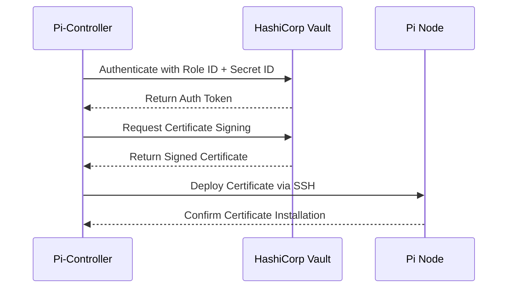
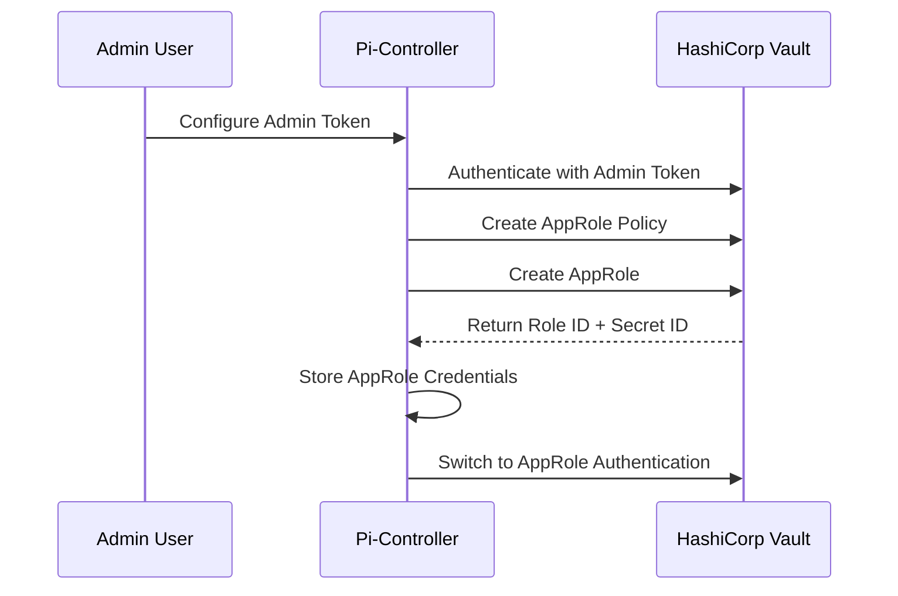
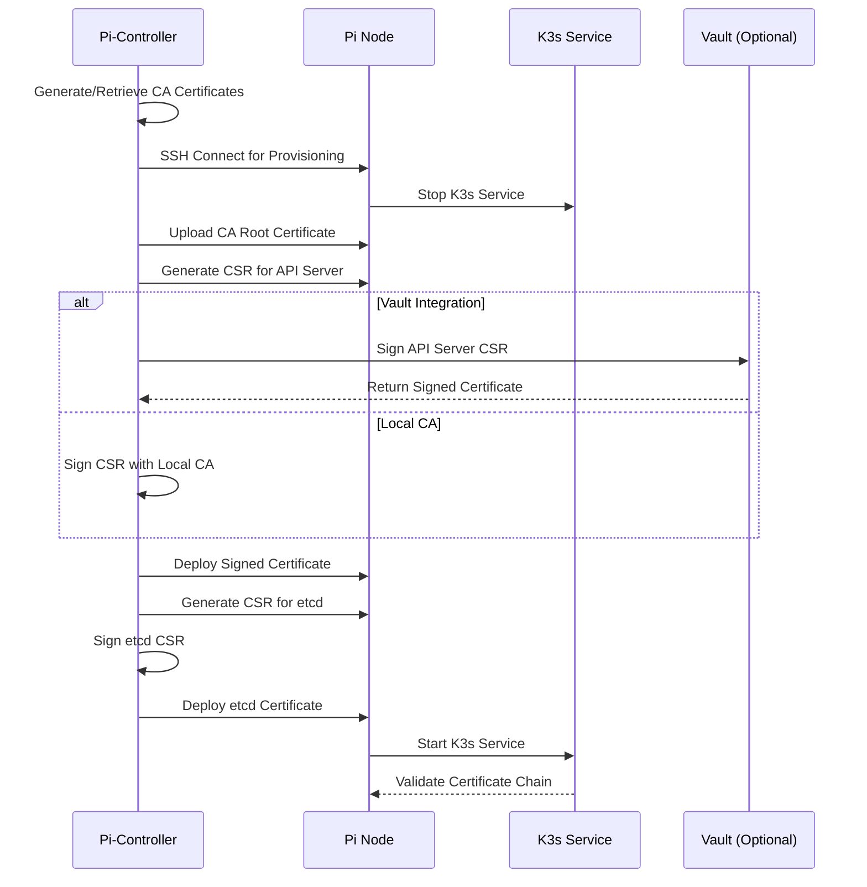
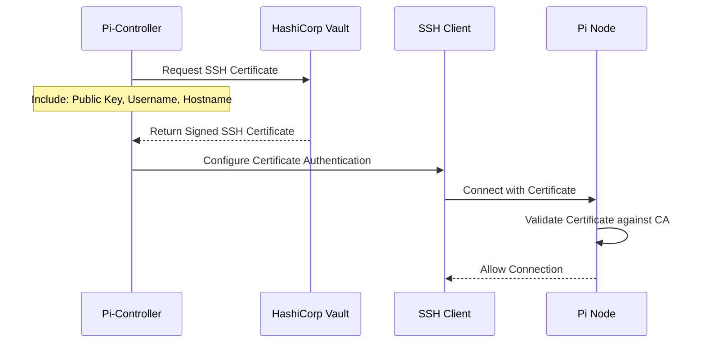
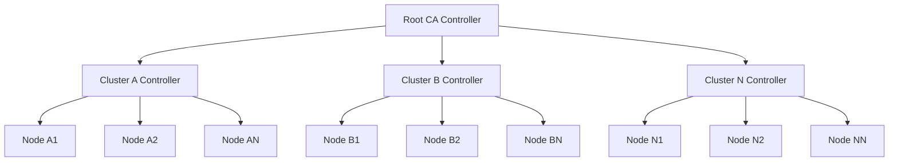
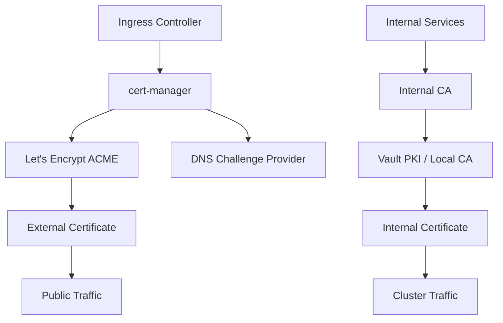

# Certificate Authority Architecture and Vault Integration Strategy

## Executive Summary

This technical specification defines a comprehensive Certificate Authority (CA) architecture for the Pi-Controller Kubernetes management platform. The system provides flexible certificate management supporting both self-signed development environments and enterprise-grade HashiCorp Vault PKI integration, with critical zero-trust security requirements ensuring cryptographic operations occur exclusively on server nodes.

**Key Business Value:**
- **Operational Security**: Zero-trust model with no keys stored on control machines
- **Deployment Flexibility**: Seamless transition from development to production environments
- **Compliance Ready**: Enterprise PKI standards with audit trails and key rotation
- **Cost Efficiency**: Optional Vault integration minimizes infrastructure overhead for smaller deployments
- **Risk Mitigation**: Distributed certificate operations prevent single points of failure

## 1. Architecture Decision Matrix

### 1.1 Certificate Authority Approaches

| Approach | Business Viability | Technical Complexity | Security Profile | Recommended Use Case |
|----------|------------------|-------------------|-----------------|-------------------|
| **Local Self-Signed CA** | High (Low Cost) | Low | Medium | Development, Small Homelabs |
| **Vault PKI Integration** | High (Enterprise) | Medium-High | High | Production, Multi-Cluster |
| **External CA Integration** | Medium (Vendor Lock) | High | High | Large Enterprise Only |
| **Let's Encrypt** | Medium (Public Only) | Medium | Medium | External Services Only |

### 1.2 Decision Criteria Analysis

**Local Self-Signed CA Advantages:**
- Zero external dependencies
- Immediate deployment capability
- No recurring costs
- Full control over certificate lifecycle

**Local Self-Signed CA Disadvantages:**
- Manual key rotation processes
- Limited audit capabilities
- No cross-cluster trust by default
- Compliance challenges in regulated environments

**Vault PKI Integration Advantages:**
- Automated certificate rotation
- Comprehensive audit logging
- Cross-environment certificate trust
- Role-based access controls
- Compliance framework compatibility

**Vault PKI Integration Disadvantages:**
- Additional infrastructure requirements
- Higher operational complexity
- Vault licensing costs for enterprise features
- Network dependency on Vault availability

### 1.3 Recommended Strategy

**Primary Recommendation: Hybrid Architecture**
- Default to Local Self-Signed CA for immediate operational capability
- Provide seamless upgrade path to Vault PKI integration
- Support both approaches simultaneously in multi-cluster environments
- Enable per-cluster CA strategy configuration

## 2. Vault Integration Strategy

### 2.1 Two-Flow AppRole Authentication Architecture

#### Flow 1: Existing AppRole Configuration
**Use Case**: Pre-configured Vault environments with existing AppRole policies



**Configuration Parameters:**
```yaml
vault:
  address: "https://vault.example.com:8200"
  pki_mount: "pki"
  role_name: "pi-controller"
  role_id: "${VAULT_ROLE_ID}"
  secret_id: "${VAULT_SECRET_ID}"
  tls_skip_verify: false  # Production default
```

#### Flow 2: Admin Token Bootstrap
**Use Case**: New Vault deployments requiring initial AppRole creation



**Bootstrap Configuration:**
```yaml
vault:
  address: "https://vault.example.com:8200"
  admin_token: "${VAULT_ADMIN_TOKEN}"  # One-time bootstrap only
  pki_mount: "pki"
  bootstrap_mode: true
  auto_create_role: true
  role_policies:
    - "pi-controller-pki"
    - "pi-controller-ssh"
```

### 2.2 Vault PKI Engine Configuration

#### PKI Mount Structure
```bash
# Root CA (Long-lived, 10 years)
vault secrets enable -path=pki pki
vault secrets tune -max-lease-ttl=87600h pki

# Intermediate CA (Medium-lived, 1 year)  
vault secrets enable -path=pki_int pki
vault secrets tune -max-lease-ttl=8760h pki_int

# Short-lived certificates (30 days default)
vault write pki_int/roles/pi-controller \
    allowed_domains="pi-controller.local,*.pi-controller.local" \
    allow_subdomains=true \
    max_ttl="720h" \
    require_cn=false \
    allow_ip_sans=true
```

#### Role-Based Certificate Policies
```hcl
# pi-controller-pki.hcl
path "pki_int/issue/pi-controller" {
  capabilities = ["create", "update"]
}

path "pki_int/certs" {
  capabilities = ["list"]
}

path "pki_int/cert/*" {
  capabilities = ["read"]
}
```

### 2.3 Security Model for Vault Integration

#### AppRole Security Best Practices
1. **Role ID Distribution**: Store in configuration, treat as identifier
2. **Secret ID Handling**: Environment variable only, never persisted
3. **Token Rotation**: 24-hour token TTL with automatic renewal
4. **Network Security**: mTLS for all Vault communications
5. **Audit Integration**: Forward Vault audit logs to central logging

#### Unsafe Development Mode
```yaml
vault:
  address: "http://vault.dev.local:8200"
  tls_skip_verify: true  # Development only
  dev_mode: true
  insecure_ssl: true
```

**Warning**: Development mode configuration must never be used in production environments.

## 3. K3s Certificate Integration

### 3.1 Certificate Replacement Strategy

K3s generates default self-signed certificates during installation. The Pi-Controller will replace these with CA-signed certificates during the provisioning process.

#### Default K3s Certificate Locations
```bash
/var/lib/rancher/k3s/server/tls/
├── server-ca.crt              # Replace with CA root
├── server-ca.key              # Replace with CA key (if local CA)
├── client-ca.crt              # Replace with CA root  
├── serving-kube-apiserver.crt # Replace with API server cert
├── serving-kube-apiserver.key # Replace with API server key
├── client-kube-controller-manager.crt
├── client-kube-controller-manager.key
└── etcd/
    ├── server-ca.crt          # Replace with CA root
    ├── server-client.crt      # Replace with etcd client cert
    └── server-client.key      # Replace with etcd client key
```

#### Certificate Replacement Workflow


### 3.2 Certificate Template Specifications

#### API Server Certificate Template
```yaml
# api-server-cert-template.yaml
common_name: "{{ .NodeName }}.pi-controller.local"
subject_alt_names:
  dns_names:
    - "kubernetes"
    - "kubernetes.default"
    - "kubernetes.default.svc"
    - "kubernetes.default.svc.cluster.local"
    - "{{ .NodeName }}"
    - "{{ .NodeName }}.pi-controller.local"
    - "localhost"
  ip_addresses:
    - "127.0.0.1"
    - "{{ .NodeIP }}"
    - "{{ .ClusterServiceIP }}"
key_usage:
  - "digital_signature"
  - "key_agreement"
  - "key_encipherment"
extended_key_usage:
  - "server_auth"
  - "client_auth"
ttl: "8760h"  # 1 year
```

#### etcd Certificate Template
```yaml
# etcd-cert-template.yaml
common_name: "{{ .NodeName }}-etcd"
subject_alt_names:
  dns_names:
    - "{{ .NodeName }}"
    - "{{ .NodeName }}.pi-controller.local"
    - "localhost"
  ip_addresses:
    - "127.0.0.1"
    - "{{ .NodeIP }}"
key_usage:
  - "digital_signature"
  - "key_agreement"
  - "key_encipherment"
extended_key_usage:
  - "server_auth"
  - "client_auth"
ttl: "8760h"  # 1 year
```

### 3.3 K3s Configuration Integration

#### Custom K3s Server Configuration
```yaml
# /etc/rancher/k3s/config.yaml
tls-san:
  - "{{ .NodeIP }}"
  - "{{ .NodeName }}.pi-controller.local"
  - "kubernetes.pi-controller.local"
cluster-cidr: "10.42.0.0/16"
service-cidr: "10.43.0.0/16"
datastore-endpoint: "https://{{ .EtcdEndpoints }}"
datastore-cafile: "/var/lib/rancher/k3s/server/tls/etcd/server-ca.crt"
datastore-certfile: "/var/lib/rancher/k3s/server/tls/etcd/server-client.crt"
datastore-keyfile: "/var/lib/rancher/k3s/server/tls/etcd/server-client.key"
```

## 4. SSH Certificate Strategy

### 4.1 Vault SSH Secrets Engine Integration

The existing SSH client implementation will be enhanced to support Vault SSH certificate authentication, providing short-lived SSH certificates for secure node access.

#### Vault SSH Engine Configuration
```bash
# Enable SSH secrets engine
vault secrets enable -path=ssh ssh

# Create SSH CA
vault write ssh/config/ca generate_signing_key=true

# Create role for Pi nodes
vault write ssh/roles/pi-nodes -<<EOF
{
  "key_type": "ca",
  "allowed_users": "pi,root",
  "allowed_domains": "pi-controller.local,*.pi-controller.local",
  "default_extensions": {
    "permit-pty": "",
    "permit-user-rc": "",
    "permit-port-forwarding": "",
    "permit-agent-forwarding": ""
  },
  "ttl": "1h",
  "max_ttl": "24h"
}
EOF
```

#### SSH Certificate Authentication Flow


### 4.2 SSH Client Configuration Enhancement

#### Enhanced SSH Client Config Structure
```go
// Enhanced SSHClientConfig with certificate support
type SSHClientConfig struct {
    // Existing fields...
    
    // Certificate authentication
    CertificateAuth    bool
    VaultSSHEngine     string
    VaultSSHRole       string
    CertificateTTL     time.Duration
    
    // Certificate caching
    CertificateCache   string
    CacheMaxAge        time.Duration
}

// SSH Certificate authentication method
func (c *SSHClient) setupCertificateAuth() (ssh.AuthMethod, error) {
    if !c.config.CertificateAuth {
        return nil, nil
    }
    
    // Request certificate from Vault
    cert, err := c.requestSSHCertificate()
    if err != nil {
        return nil, err
    }
    
    // Create signer with certificate
    signer, err := ssh.ParsePrivateKey(cert.PrivateKey)
    if err != nil {
        return nil, err
    }
    
    // Add certificate to signer
    certSigner, err := ssh.NewCertSigner(cert.Certificate, signer)
    if err != nil {
        return nil, err
    }
    
    return ssh.PublicKeys(certSigner), nil
}
```

### 4.3 Certificate Lifecycle Management

#### Automatic Certificate Renewal
```go
type CertificateManager struct {
    vault          *VaultClient
    cache          *CertificateCache
    renewalBuffer  time.Duration
    ticker         *time.Ticker
}

func (cm *CertificateManager) startRenewalLoop() {
    cm.ticker = time.NewTicker(time.Hour)
    
    go func() {
        for range cm.ticker.C {
            cm.checkAndRenewCertificates()
        }
    }()
}

func (cm *CertificateManager) checkAndRenewCertificates() {
    certificates := cm.cache.GetExpiringCertificates(cm.renewalBuffer)
    
    for _, cert := range certificates {
        newCert, err := cm.vault.RenewSSHCertificate(cert)
        if err != nil {
            cm.logger.WithError(err).Error("Failed to renew SSH certificate")
            continue
        }
        
        cm.cache.StoreCertificate(cert.ID, newCert)
    }
}
```

## 5. Security Model Definition

### 5.1 Zero-Trust Architecture

**Fundamental Principle**: The control machine (Pi-Controller) must NEVER store, access, or operate with cryptographic private keys.

#### Key Security Boundaries
1. **Certificate Generation**: All private keys generated exclusively on target nodes
2. **CSR Processing**: Control plane handles only Certificate Signing Requests
3. **Certificate Distribution**: Signed certificates deployed via secure channels
4. **Key Rotation**: Automated on-node key generation and CSR submission

### 5.2 Node-Based Cryptographic Operations

#### Certificate Generation Workflow
```bash
#!/bin/bash
# On-node certificate generation script
# Executed via SSH on each Pi node

NODE_NAME="$1"
CERT_TYPE="$2"  # api-server, etcd, kubelet
OUTPUT_DIR="/tmp/pi-controller-certs"

# Generate private key (never leaves node)
openssl genrsa -out "${OUTPUT_DIR}/${CERT_TYPE}.key" 2048

# Generate Certificate Signing Request
openssl req -new \
    -key "${OUTPUT_DIR}/${CERT_TYPE}.key" \
    -out "${OUTPUT_DIR}/${CERT_TYPE}.csr" \
    -config "/tmp/cert-template-${CERT_TYPE}.conf"

# Submit CSR to controller (via secure channel)
curl -X POST \
    --cert /etc/pi-controller/client.crt \
    --key /etc/pi-controller/client.key \
    --cacert /etc/pi-controller/ca.crt \
    -H "Content-Type: application/x-pem-file" \
    --data-binary "@${OUTPUT_DIR}/${CERT_TYPE}.csr" \
    "https://pi-controller.local:8080/api/v1/certificates/sign"
```

### 5.3 Audit and Compliance Framework

#### Certificate Authority Audit Trail
```go
type CertificateAuditEvent struct {
    EventID       string    `json:"event_id"`
    Timestamp     time.Time `json:"timestamp"`
    EventType     string    `json:"event_type"`     // sign, revoke, renew
    NodeID        string    `json:"node_id"`
    CertificateID string    `json:"certificate_id"`
    Subject       string    `json:"subject"`
    Issuer        string    `json:"issuer"`
    SerialNumber  string    `json:"serial_number"`
    ValidFrom     time.Time `json:"valid_from"`
    ValidTo       time.Time `json:"valid_to"`
    RequestorIP   string    `json:"requestor_ip"`
    UserAgent     string    `json:"user_agent"`
}

type AuditLogger interface {
    LogCertificateEvent(event CertificateAuditEvent) error
    QueryEvents(filter AuditFilter) ([]CertificateAuditEvent, error)
    ExportAuditLog(format string, timeRange TimeRange) ([]byte, error)
}
```

#### Compliance Integration Points
- **FIPS 140-2**: Cryptographic module validation support
- **Common Criteria**: Security evaluation standards compliance
- **SOC 2 Type II**: Audit trail and access control requirements
- **PCI DSS**: Key management and certificate lifecycle standards

## 6. Scalability Planning

### 6.1 Multi-Cluster Certificate Management

#### Cluster Certificate Hierarchy
```
Root CA (10 year)
├── Cluster A Intermediate CA (1 year)
│   ├── Node Certificates (30 days)
│   ├── Service Certificates (30 days)
│   └── Client Certificates (30 days)
├── Cluster B Intermediate CA (1 year)
│   ├── Node Certificates (30 days)
│   ├── Service Certificates (30 days)
│   └── Client Certificates (30 days)
└── Cross-Cluster Trust CA (1 year)
    ├── Inter-Cluster Service Certificates (30 days)
    └── Cross-Cluster Client Certificates (30 days)
```

#### Distributed Certificate Distribution


### 6.2 Performance Optimization

#### Certificate Caching Strategy
```go
type CertificateCache struct {
    entries    map[string]*CachedCertificate
    mutex      sync.RWMutex
    maxSize    int
    ttl        time.Duration
    hitCounter *prometheus.CounterVec
}

type CachedCertificate struct {
    Certificate *x509.Certificate
    PrivateKey  interface{} // Never stored in control plane
    CSR         *x509.CertificateRequest
    CreatedAt   time.Time
    AccessCount int64
    LastAccess  time.Time
}

// Performance metrics
func (cc *CertificateCache) GetCacheStats() CacheStats {
    cc.mutex.RLock()
    defer cc.mutex.RUnlock()
    
    return CacheStats{
        Size:        len(cc.entries),
        MaxSize:     cc.maxSize,
        HitRate:     cc.calculateHitRate(),
        EvictionRate: cc.calculateEvictionRate(),
    }
}
```

#### Batch Certificate Operations
```go
type BatchCertificateRequest struct {
    Requests []CertificateRequest `json:"requests"`
    BatchID  string               `json:"batch_id"`
}

type BatchCertificateResponse struct {
    Certificates []SignedCertificate `json:"certificates"`
    BatchID      string              `json:"batch_id"`
    SuccessCount int                 `json:"success_count"`
    ErrorCount   int                 `json:"error_count"`
    Errors       []BatchError        `json:"errors,omitempty"`
}

// Process multiple certificate requests in parallel
func (ca *CertificateAuthority) ProcessBatchRequest(
    ctx context.Context, 
    batch BatchCertificateRequest,
) (*BatchCertificateResponse, error) {
    
    semaphore := make(chan struct{}, 10) // Limit concurrent operations
    var wg sync.WaitGroup
    results := make(chan SignedCertificate, len(batch.Requests))
    errors := make(chan BatchError, len(batch.Requests))
    
    for i, req := range batch.Requests {
        wg.Add(1)
        go func(index int, request CertificateRequest) {
            defer wg.Done()
            semaphore <- struct{}{} // Acquire
            defer func() { <-semaphore }() // Release
            
            cert, err := ca.SignCertificate(ctx, request)
            if err != nil {
                errors <- BatchError{Index: index, Error: err.Error()}
                return
            }
            results <- cert
        }(i, req)
    }
    
    wg.Wait()
    close(results)
    close(errors)
    
    // Collect results
    response := &BatchCertificateResponse{
        BatchID: batch.BatchID,
    }
    
    for cert := range results {
        response.Certificates = append(response.Certificates, cert)
        response.SuccessCount++
    }
    
    for err := range errors {
        response.Errors = append(response.Errors, err)
        response.ErrorCount++
    }
    
    return response, nil
}
```

## 7. Environment Configuration Strategy

### 7.1 Configuration Hierarchy

#### Configuration Priority Order (Highest to Lowest)
1. Command-line flags
2. Environment variables
3. Configuration file (YAML)
4. Default values

#### Environment-Specific Configuration Templates

**Development Environment**
```yaml
# config/development.yaml
certificate_authority:
  mode: "local"
  ca_cert_ttl: "8760h"    # 1 year
  cert_ttl: "720h"        # 30 days
  key_algorithm: "RSA"
  key_size: 2048
  organization: "Pi-Controller Development"
  
vault:
  enabled: false
  
tls:
  skip_verify: true       # Development only
  min_version: "1.2"
  
ssh:
  certificate_auth: false
  allow_password_auth: true
```

**Staging Environment**
```yaml
# config/staging.yaml  
certificate_authority:
  mode: "vault"
  ca_cert_ttl: "8760h"
  cert_ttl: "168h"        # 1 week (shorter for testing)
  key_algorithm: "ECDSA"
  key_size: 256
  organization: "Pi-Controller Staging"
  
vault:
  enabled: true
  address: "https://vault-staging.example.com:8200"
  pki_mount: "pki_staging"
  role_name: "pi-controller-staging"
  tls_skip_verify: false
  
tls:
  skip_verify: false
  min_version: "1.3"
  
ssh:
  certificate_auth: true
  certificate_ttl: "1h"
```

**Production Environment**
```yaml
# config/production.yaml
certificate_authority:
  mode: "vault"
  ca_cert_ttl: "87600h"   # 10 years
  cert_ttl: "72h"         # 3 days (short-lived)
  key_algorithm: "ECDSA"
  key_size: 384
  organization: "Pi-Controller Production"
  
vault:
  enabled: true
  address: "https://vault.example.com:8200"
  pki_mount: "pki"
  role_name: "pi-controller"
  tls_skip_verify: false
  ha_enabled: true
  retry_attempts: 5
  
tls:
  skip_verify: false
  min_version: "1.3"
  cipher_suites:
    - "TLS_AES_256_GCM_SHA384"
    - "TLS_CHACHA20_POLY1305_SHA256"
    - "TLS_AES_128_GCM_SHA256"
  
ssh:
  certificate_auth: true
  certificate_ttl: "30m"
  max_session_duration: "4h"
```

### 7.2 Configuration Validation

#### Environment Validation Rules
```go
type ConfigValidator struct {
    environment string
    rules       []ValidationRule
}

type ValidationRule struct {
    Field       string
    Required    bool
    Validator   func(interface{}) error
    Environment []string // Which environments this rule applies to
}

func (cv *ConfigValidator) ValidateConfig(config *Config) error {
    var errors []error
    
    for _, rule := range cv.rules {
        if !cv.appliesToEnvironment(rule) {
            continue
        }
        
        value := cv.getFieldValue(config, rule.Field)
        
        if rule.Required && cv.isEmpty(value) {
            errors = append(errors, fmt.Errorf("field %s is required in %s environment", 
                rule.Field, cv.environment))
            continue
        }
        
        if rule.Validator != nil {
            if err := rule.Validator(value); err != nil {
                errors = append(errors, fmt.Errorf("validation failed for %s: %w", 
                    rule.Field, err))
            }
        }
    }
    
    if len(errors) > 0 {
        return fmt.Errorf("configuration validation failed: %v", errors)
    }
    
    return nil
}

// Production environment validation rules
var productionRules = []ValidationRule{
    {
        Field:       "vault.address",
        Required:    true,
        Environment: []string{"production", "staging"},
        Validator: func(v interface{}) error {
            addr, ok := v.(string)
            if !ok || !strings.HasPrefix(addr, "https://") {
                return fmt.Errorf("vault address must use HTTPS in production")
            }
            return nil
        },
    },
    {
        Field:       "tls.skip_verify",
        Required:    true,
        Environment: []string{"production", "staging"},
        Validator: func(v interface{}) error {
            skip, ok := v.(bool)
            if !ok || skip {
                return fmt.Errorf("TLS verification cannot be skipped in production")
            }
            return nil
        },
    },
}
```

## 8. Let's Encrypt Integration Architecture

### 8.1 External Certificate Management Strategy

Let's Encrypt integration is designed exclusively for external-facing services, particularly ingress controllers and public APIs, while maintaining the internal CA for cluster-internal communication.

#### Integration Architecture


### 8.2 cert-manager Integration

#### cert-manager ClusterIssuer Configuration
```yaml
apiVersion: cert-manager.io/v1
kind: ClusterIssuer
metadata:
  name: letsencrypt-production
spec:
  acme:
    server: https://acme-v02.api.letsencrypt.org/directory
    email: admin@pi-controller.example.com
    privateKeySecretRef:
      name: letsencrypt-production
    solvers:
    - dns01:
        route53:
          region: us-east-1
          secretAccessKeySecretRef:
            name: route53-credentials
            key: secret-access-key
        selector:
          dnsZones:
          - "pi-controller.example.com"
    - http01:
        ingress:
          class: nginx
```

#### Internal CA ClusterIssuer
```yaml
apiVersion: cert-manager.io/v1
kind: ClusterIssuer
metadata:
  name: pi-controller-ca
spec:
  ca:
    secretName: pi-controller-ca-secret
```

### 8.3 Dual Certificate Strategy

#### Certificate Separation Policy
```yaml
# External ingress with Let's Encrypt
apiVersion: networking.k8s.io/v1
kind: Ingress
metadata:
  name: pi-controller-external
  annotations:
    cert-manager.io/cluster-issuer: "letsencrypt-production"
    kubernetes.io/ingress.class: "nginx"
spec:
  tls:
  - hosts:
    - api.pi-controller.example.com
    secretName: pi-controller-external-tls
  rules:
  - host: api.pi-controller.example.com
    http:
      paths:
      - path: /api/v1/public
        pathType: Prefix
        backend:
          service:
            name: pi-controller-api
            port:
              number: 8080

---
# Internal service with internal CA
apiVersion: v1
kind: Service
metadata:
  name: pi-controller-internal
  annotations:
    cert-manager.io/cluster-issuer: "pi-controller-ca"
spec:
  type: ClusterIP
  ports:
  - port: 9090
    protocol: TCP
    targetPort: grpc
  selector:
    app: pi-controller
```

#### Certificate Renewal Automation
```go
type CertificateRenewalManager struct {
    certManager  *CertManagerClient
    internalCA   *InternalCA
    logger       logger.Interface
    metrics      *CertificateMetrics
}

func (crm *CertificateRenewalManager) StartRenewalLoop(ctx context.Context) {
    ticker := time.NewTicker(12 * time.Hour) // Check twice daily
    defer ticker.Stop()
    
    for {
        select {
        case <-ctx.Done():
            return
        case <-ticker.C:
            crm.checkAndRenewCertificates(ctx)
        }
    }
}

func (crm *CertificateRenewalManager) checkAndRenewCertificates(ctx context.Context) {
    // Check Let's Encrypt certificates
    externalCerts, err := crm.certManager.GetExpiringCertificates(ctx, 30*24*time.Hour)
    if err != nil {
        crm.logger.WithError(err).Error("Failed to check external certificates")
        crm.metrics.RenewalErrors.WithLabelValues("external").Inc()
    }
    
    for _, cert := range externalCerts {
        if err := crm.renewExternalCertificate(ctx, cert); err != nil {
            crm.logger.WithError(err).
                WithField("certificate", cert.Name).
                Error("Failed to renew external certificate")
            crm.metrics.RenewalErrors.WithLabelValues("external").Inc()
        } else {
            crm.metrics.RenewalSuccess.WithLabelValues("external").Inc()
        }
    }
    
    // Check internal CA certificates
    internalCerts, err := crm.internalCA.GetExpiringCertificates(ctx, 72*time.Hour)
    if err != nil {
        crm.logger.WithError(err).Error("Failed to check internal certificates")
        crm.metrics.RenewalErrors.WithLabelValues("internal").Inc()
    }
    
    for _, cert := range internalCerts {
        if err := crm.renewInternalCertificate(ctx, cert); err != nil {
            crm.logger.WithError(err).
                WithField("certificate", cert.Name).
                Error("Failed to renew internal certificate")
            crm.metrics.RenewalErrors.WithLabelValues("internal").Inc()
        } else {
            crm.metrics.RenewalSuccess.WithLabelValues("internal").Inc()
        }
    }
}
```

## 9. Implementation Roadmap

### Phase 1: Foundation (Weeks 1-2)
- Local Self-Signed CA implementation
- Basic certificate generation and signing
- CSR processing endpoints
- Node certificate deployment via SSH

### Phase 2: Vault Integration (Weeks 3-4)  
- Vault PKI engine integration
- AppRole authentication flows
- SSH certificate support
- Configuration management

### Phase 3: K3s Integration (Weeks 5-6)
- K3s certificate replacement workflows
- Certificate template system
- Cluster provisioning integration
- Certificate lifecycle management

### Phase 4: Advanced Features (Weeks 7-8)
- cert-manager integration
- Let's Encrypt external certificates
- Multi-cluster certificate management
- Performance optimization

### Phase 5: Production Hardening (Weeks 9-10)
- Security audit and compliance
- Performance testing and optimization
- Documentation and operational runbooks
- Monitoring and alerting integration

## 10. Risk Assessment and Mitigation

### High-Risk Items
1. **Certificate Key Exposure**: Mitigated by zero-trust node-only key generation
2. **Vault Connectivity Failure**: Mitigated by local CA fallback capability
3. **Certificate Expiration**: Mitigated by automated renewal and monitoring
4. **CA Compromise**: Mitigated by intermediate CA strategy and key rotation

### Medium-Risk Items
1. **Performance Impact**: Mitigated by certificate caching and batch operations
2. **Configuration Complexity**: Mitigated by environment-specific templates
3. **Cross-Cluster Trust**: Mitigated by hierarchical CA architecture

### Low-Risk Items
1. **Let's Encrypt Rate Limits**: Mitigated by staging environment testing
2. **cert-manager Dependencies**: Mitigated by optional integration design

## Conclusion

This comprehensive CA architecture provides a robust, scalable, and secure foundation for certificate management in the Pi-Controller ecosystem. The hybrid approach ensures immediate operational capability while providing clear upgrade paths to enterprise-grade security standards.

**Key Success Metrics:**
- Zero cryptographic key exposure on control machines
- Sub-5-minute certificate provisioning times
- 99.9% certificate availability uptime
- Seamless development-to-production transitions
- Full audit compliance for regulated environments

**Business Impact:**
- Reduced operational security risks through zero-trust design
- Lowered total cost of ownership through flexible deployment options
- Enhanced compliance posture for enterprise adoption
- Improved operational efficiency through automation
- Future-proof architecture supporting multi-cloud deployments

The architecture balances immediate development needs with long-term enterprise requirements, ensuring the Pi-Controller platform can scale from hobbyist homelabs to production enterprise deployments while maintaining the highest security standards.