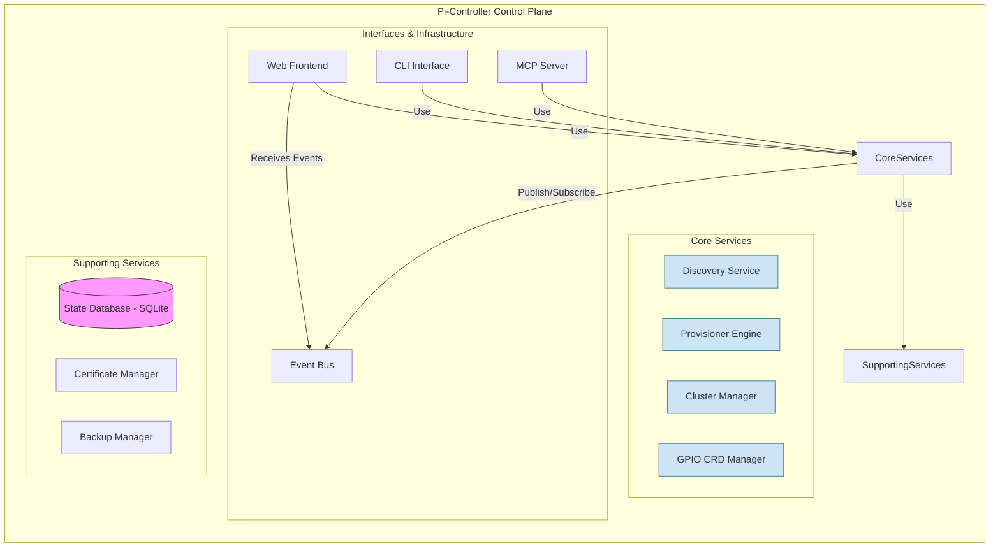

# Control Plane Architecture

The Pi-Controller Control Plane is the brain of the system. It runs as a single Go binary and is responsible for cluster management, node provisioning, and exposing the system's APIs. It can be deployed in a high-availability configuration across multiple master nodes.

## Component Diagram

The diagram below illustrates the major components within the control plane and their interactions.

## Core Components

### Discovery Service
*   **Purpose**: Automatically discovers Raspberry Pi nodes on the network.
*   **Technology**: mDNS, network scanning, DHCP lease parsing.
*   **Key Features**: Detects hardware capabilities (GPIO, I2C, etc.), maps network topology, and manages cluster membership.

### Provisioner Engine
*   **Purpose**: Automates the bootstrapping of K3s clusters and joining of nodes.
*   **Technology**: SSH, K3s installation scripts, certificate management.
*   **Key Features**: Zero-touch K3s installation, HA control plane setup, secure token management, and Pi-optimized configurations.

### Cluster Manager
*   **Purpose**: Manages the lifecycle of Kubernetes clusters and reconciles their state.
*   **Technology**: Kubernetes client-go, custom controllers.
*   **Key Features**: Multi-cluster state synchronization, workload placement optimization, resource quota management, and automated rolling updates.

### GPIO CRD Manager
*   **Purpose**: Provides Kubernetes-native GPIO control via Custom Resource Definitions (CRDs).
*   **Technology**: Kubernetes controller-runtime.
*   **Key Features**: Manages `GPIOPin`, `PWMController`, and `I2CDevice` CRDs, translating them into hardware operations on the target nodes.

## Supporting Components

*   **Web Frontend / CLI**: Provide human interfaces for interacting with the control plane.
*   **MCP Server**: The main API gateway for both gRPC and REST traffic.
*   **Event Bus**: An in-memory bus for distributing real-time events between components and to clients via WebSockets.
*   **State Database**: An embedded SQLite database for persisting all system state, including nodes, clusters, and configurations.
*   **Certificate Manager**: Manages the lifecycle of all TLS certificates used for secure communication.
*   **Backup Manager**: Handles the backup and restore of the control plane's state.