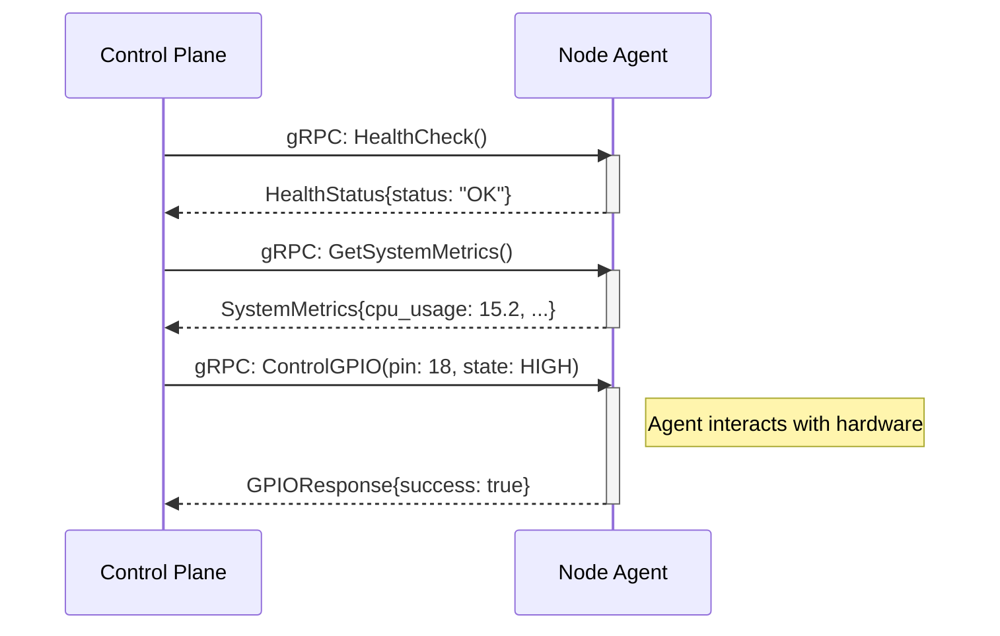

# gRPC API Reference

The Pi-Controller uses gRPC for high-performance, low-latency communication, primarily between the Control Plane and the Node Agents. All gRPC communication is secured using mutual TLS (mTLS), ensuring that both the client and server can verify each other's identity.

## Communication Flow

The primary use case for gRPC is for the Control Plane to issue commands and request data from individual Node Agents.



---

## NodeAgent Service

This service is exposed by the `pi-agent` binary running on every node in the cluster. It allows the Control Plane to directly interact with the node's hardware and system.

**Protobuf Definition:**
```protobuf
service NodeAgent {
    // Fetches real-time system metrics from the node.
    rpc GetSystemMetrics(Empty) returns (SystemMetrics);

    // Sends a command to control a GPIO pin.
    rpc ControlGPIO(GPIORequest) returns (GPIOResponse);

    // Executes a shell command on the node for diagnostic purposes.
    rpc ExecuteCommand(CommandRequest) returns (CommandResponse);

    // Streams log entries from the node to the control plane.
    rpc StreamLogs(LogFilter) returns (stream LogEntry);

    // Performs a health check on the node agent.
    rpc HealthCheck(Empty) returns (HealthStatus);
}
```

## ControlPlane Service

This service is used for internal communication between Control Plane instances in a high-availability setup and for nodes to register themselves.

**Protobuf Definition:**
```protobuf
service ControlPlane {
    // Allows a new node to register itself with the control plane.
    rpc RegisterNode(NodeRegistration) returns (RegistrationResponse);
    // Synchronizes state between control plane instances.
    rpc SyncClusterState(ClusterStateRequest) returns (ClusterStateResponse);
    // Triggers the provisioning engine for a specific node or cluster.
    rpc RequestProvisioning(ProvisioningRequest) returns (ProvisioningResponse);
    // Allows agents and services to report their health status.
    rpc ReportHealth(HealthReport) returns (Empty);
}
```