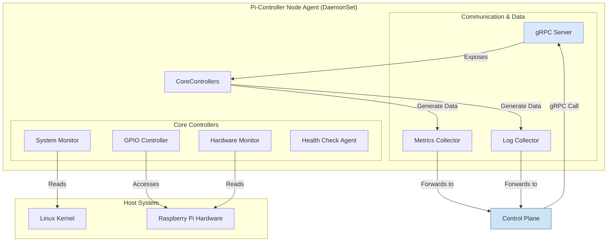

# Node Agent Architecture

The Pi-Controller Node Agent is a lightweight component that runs on every Raspberry Pi in the cluster. It is deployed as a Kubernetes DaemonSet to ensure it is present on all nodes, including masters. The agent acts as the bridge between the control plane and the individual node's hardware and system.

## Component Diagram

The agent is composed of several specialized controllers that communicate with the host system and expose functionality to the control plane via gRPC.

## Key Responsibilities

*   **System Monitoring**: Collects and streams real-time system metrics like CPU usage, memory, and disk space.
*   **Hardware Control**: Provides direct, secure access to GPIO pins and other hardware interfaces (I2C, SPI) as instructed by the control plane. This is the component that executes the actions defined by the GPIO CRDs.
*   **Hardware Monitoring**: Monitors hardware health, such as CPU temperature and voltage, to ensure the Pi is operating within safe limits.
*   **Health Checks**: Reports the health of the node and the agent itself back to the control plane.
*   **Secure Communication**: Establishes a secure mTLS-encrypted gRPC connection to the control plane for all communication.
*   **Log & Metrics Collection**: Gathers logs and metrics from the node and forwards them to a central location as configured by the control plane.