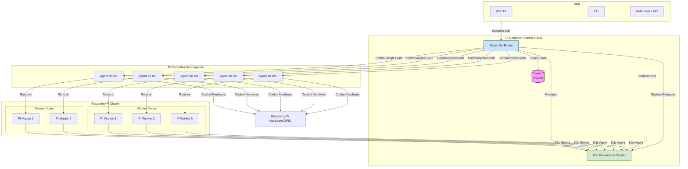

# System Architecture Overview

Pi-Controller is a comprehensive Kubernetes management platform designed specifically for Raspberry Pi clusters. The system provides automated discovery, provisioning, and lifecycle management of K3s clusters while offering GPIO-as-a-Service capabilities through Kubernetes Custom Resources.

## High-Level Diagram

This diagram shows the main actors and components of the Pi-Controller ecosystem.

## Core Philosophy
-   **Single Binary Deployment**: The control plane runs as one Go binary with an embedded web UI for simplicity.
-   **Zero Dependencies**: No external automation tools like Ansible or Terraform are required.
-   **Pi-Native**: Optimized for the hardware constraints of ARM64/ARMv7 devices.
-   **Kubernetes-First**: All hardware control, including GPIO, is managed through standard Kubernetes APIs and Custom Resources.
-   **Homelab-Friendly**: Designed for simple deployment while being scalable enough for enterprise use cases.